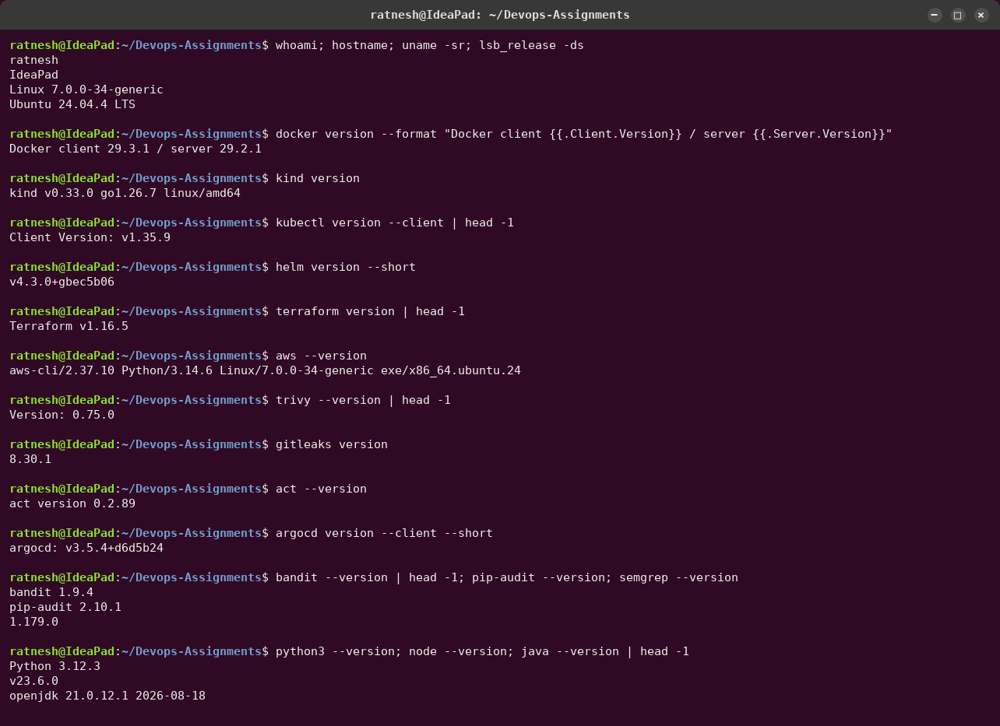
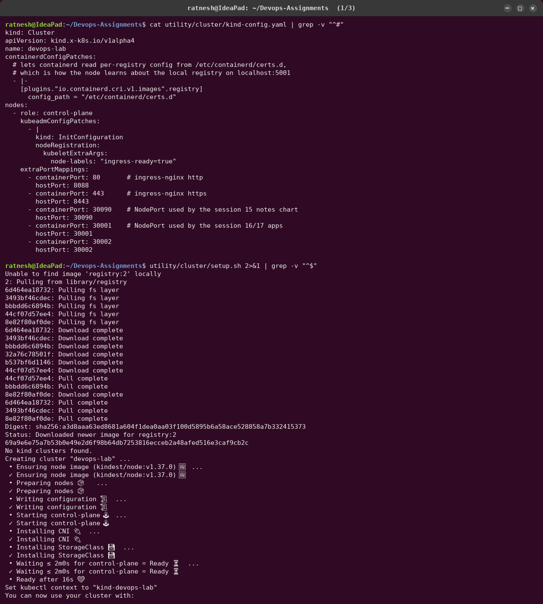

# DevOps Assignments — Sessions 13 to 21

**Name:** Ratnesh Vaibhav  ·  **Roll No:** 24bcs10413

Homework for the second half of the DevOps course, from Kubernetes storage to the final
end-to-end project. Every task was done hands-on on my own laptop (`ratnesh@IdeaPad`,
Ubuntu 24.04), and every command shown in a screenshot was actually run.

| # | Session | Folder | What is in it |
|---|---|---|---|
| 13 | Kubernetes Storage, HPA & Probes | [`session-13-storage-hpa-probes/`](session-13-storage-hpa-probes/) | emptyDir, hostPath, PV/PVC, StorageClass + dynamic provisioning; HPA 1→5→1 under load; startup/readiness/liveness; PVC + probes + HPA mini project |
| 14 | Kubernetes Troubleshooting | [`session-14-kubernetes-troubleshooting/`](session-14-kubernetes-troubleshooting/) | `get/describe/logs/exec/events/explain/top`; 9 broken scenarios (CrashLoopBackOff, image pulls, Pending, ContainerCreating, Service, DNS, Pod networking + NetworkPolicy, config, OOMKilled) with before/after |
| 15 | Helm | [`session-15-helm/`](session-15-helm/) | every Helm command, a rollback workflow behind the ingress (v3 marked `failed`, rollback to v2), the notes-chart mini project |
| 16 | CI/CD & GitHub Actions | [`session-16-cicd-github-actions/`](session-16-cicd-github-actions/) | CGPA calculator API; lint, 3-version test matrix, artifacts, SHA-tagged image, push, Kubernetes deploy; a run stopped by a failing test |
| 17 | Complete CI/CD & DevSecOps | [`session-17-devsecops/`](session-17-devsecops/) | Bandit, Semgrep, pip-audit, Trivy fs/image, Gitleaks, one security gate; the gate blocking six classes of injected issues; Pod Security `restricted` |
| 18 | Terraform & IaC | [`session-18-terraform-iac/`](session-18-terraform-iac/) | S3 demo through the full Terraform lifecycle incl. drift detection; IAM, EC2, S3, VPC, DynamoDB/RDS research with hands-on runs |
| 19 | Cloud & Terraform in Action | [`session-19-cloud-terraform/`](session-19-cloud-terraform/) | VPC, subnets, SG, EC2, S3, IAM role; remote S3 state with native locking; dependency graph; in-place change |
| 20 | Monitoring, Observability & GitOps | [`session-20-monitoring-observability-gitops/`](session-20-monitoring-observability-gitops/) | kube-prometheus-stack; 5 alerts fired, routed and resolved; JSON logs; Grafana; observability notes; Argo CD sync, self-heal, prune, rollback |
| 21 | Final DevOps Project & Troubleshooting | [`session-21-final-devops-project/`](session-21-final-devops-project/) | **ShelfShare** (FastAPI + React + PostgreSQL) through Git → CI → security gate → registry → Kubernetes/Helm → monitoring → GitOps, Terraform VPC + EKS, and the troubleshooting challenge |

## How the evidence was produced

Every terminal screenshot is a PNG rendered **from a recorded transcript** of a real run:

```text
utility/
├── transcripts/<session>/*.log     raw terminal transcripts: "$ command" followed by its real output
│   └── <session>/raw/*.txt         full logs of long runs (pipelines, terraform plans)
├── screenshots/<session>/*.png     rendered terminal windows; web_*.png are real headless-Chrome captures
├── tools/                          capture.sh, termshot.py, webshot.py, ptyrun.py, render_all.sh
├── cluster/                        the kind cluster used by sessions 13-21 (setup.sh, kind-config.yaml)
└── aws-emulator/                   local AWS API (Moto) used for the Terraform sessions
```

- [`capture.sh`](utility/tools/capture.sh) writes each command as `$ <command>` and appends its
  real stdout/stderr. Nothing is edited afterwards.
- [`termshot.py`](utility/tools/termshot.py) renders a transcript as an Ubuntu gnome-terminal
  window. The `ratnesh@IdeaPad` prompt is read from the machine (`getpass`/`socket`), not typed in.
- [`ptyrun.py`](utility/tools/ptyrun.py) drives interactive prompts (`terraform apply` →
  `Enter a value: yes`) through a real pseudo-terminal.
- [`webshot.py`](utility/tools/webshot.py) captures a running UI with headless Chrome and frames
  it with the URL bar, so the screenshot shows which address served the page.
- `utility/tools/render_all.sh` regenerates every screenshot from its transcript and reports any
  PNG without one.



## Lab environment

| Component | Version / detail |
|---|---|
| Kubernetes | kind v0.33.0 → Kubernetes **v1.37.0**, one node, containerd 2.3.4 |
| Add-ons | metrics-server v0.9.0, ingress-nginx v1.15.1 (ports 80/443 → 8088/8443; Apache already owns port 80) |
| Registry | `registry:2` on `localhost:5001`, wired into the node's containerd |
| CLI tools | kubectl 1.35.9, Helm 4.3.0, Terraform 1.16.5, AWS CLI 2.37, Trivy 0.75.0, Gitleaks 8.30.1, act 0.2.89, Argo CD CLI 3.5.4 |
| AWS | **local emulator (Moto)**. There are no AWS credentials on this laptop. Terraform and the AWS CLI hit real AWS APIs implemented locally; nothing is billed. All Terraform code deploys to real AWS by removing `aws_endpoint` from `terraform.tfvars` |
| GitHub Actions | workflows live in [`.github/workflows/`](.github/workflows/) and run on GitHub after a push. Locally they were executed with **act**, which runs each job in a container that mimics a GitHub runner |



### Environment problems solved on the way

- **Docker Hub rate limit** (`429 Too Many Requests`): the network's shared IP had used up the
  anonymous quota. Docker Hub images are pulled through `mirror.gcr.io`, both by Docker
  (`registry-mirrors`) and by the kind node's containerd ([`setup.sh`](utility/cluster/setup.sh)).
- **Memory:** the Docker Desktop VM has 3.2 GiB for the whole lab. The final project hit
  that limit for real; see the incident write-up in Session 21.

## Re-running

```bash
utility/cluster/setup.sh                 # kind cluster + registry + metrics-server + ingress-nginx
utility/aws-emulator/start.sh            # local AWS API for sessions 18, 19, 21
source utility/aws-emulator/env.sh
utility/tools/render_all.sh              # rebuild every screenshot from utility/transcripts
```
