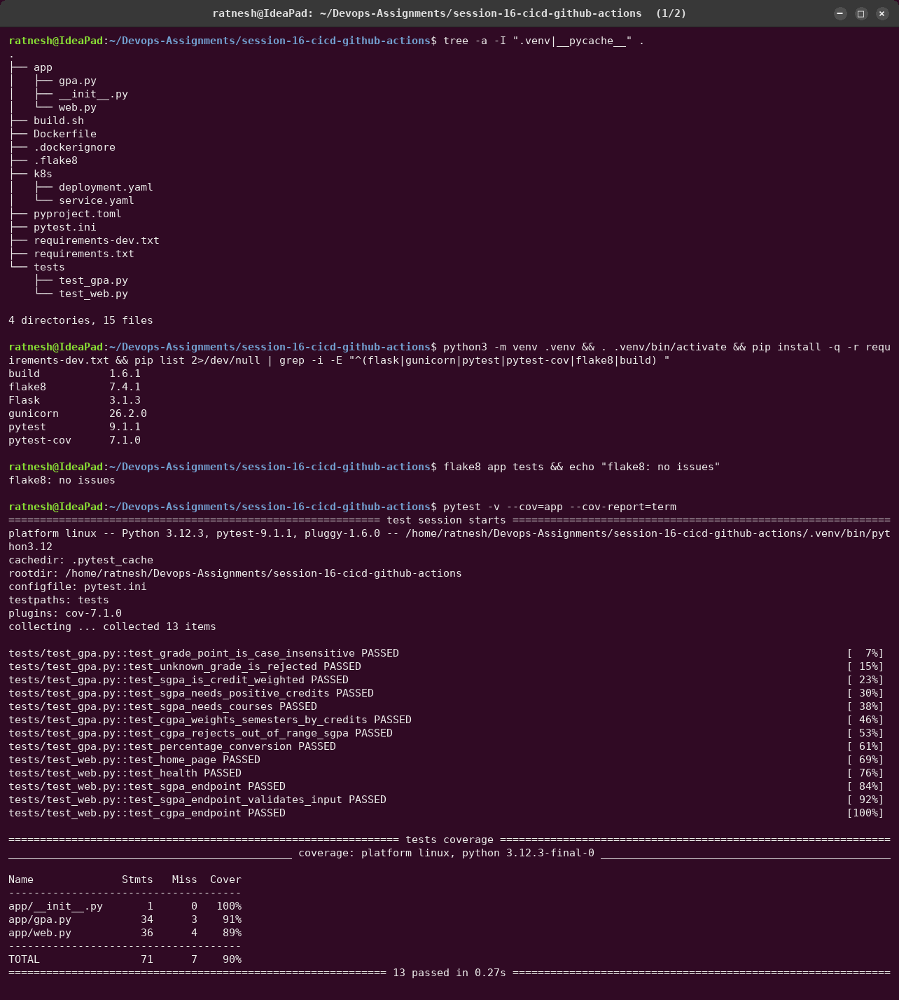
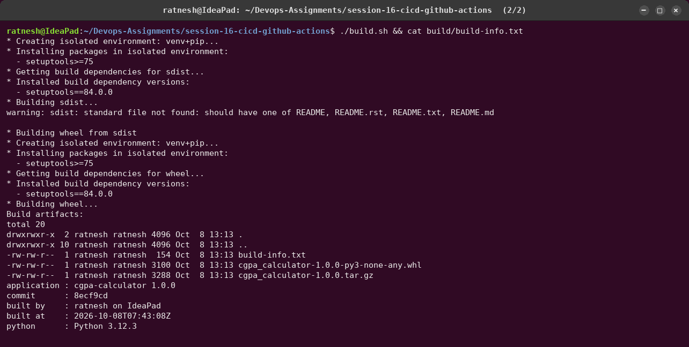
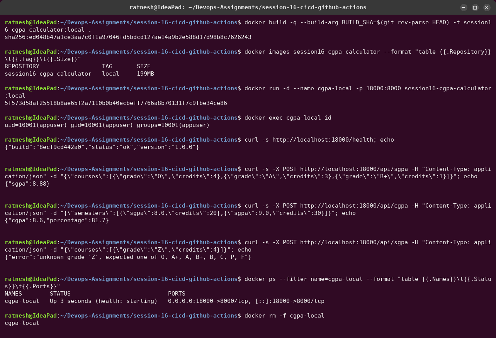
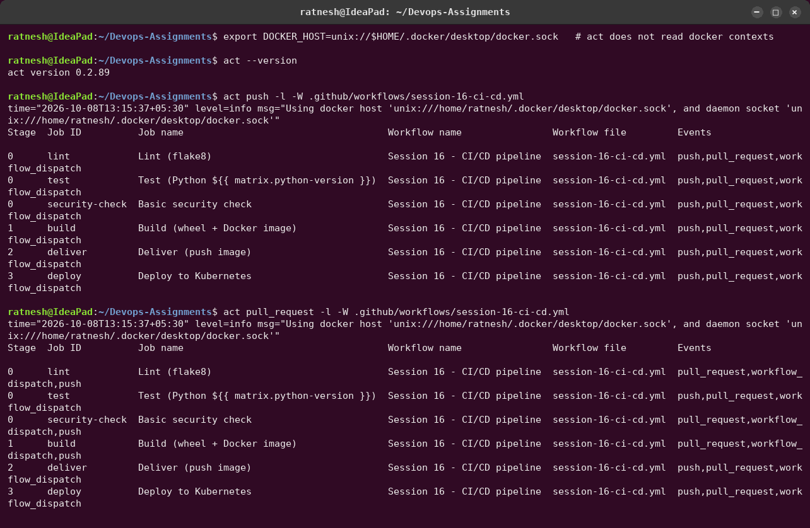
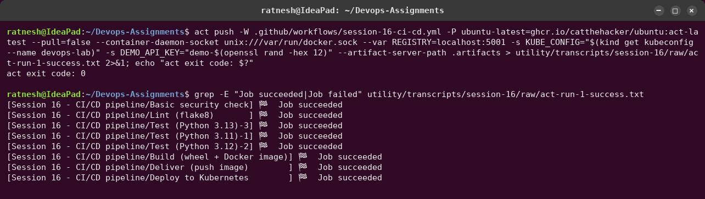
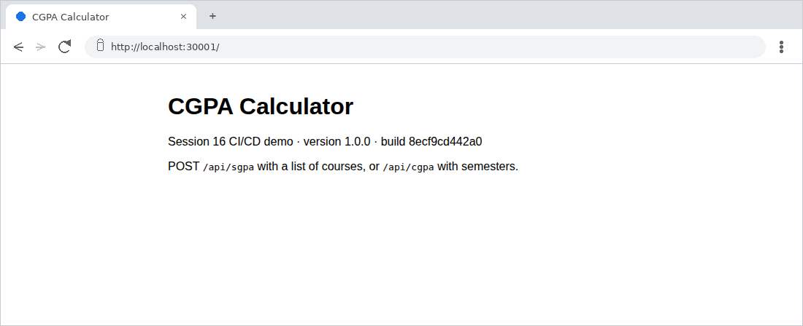

# Session 16 — CI/CD & GitHub Actions

**Name:** Ratnesh Vaibhav  ·  **Roll No:** 24bcs10413

A complete CI/CD demo project: a small **CGPA calculator API** (Flask), its tests, a
Dockerfile, Kubernetes manifests, and one GitHub Actions workflow that goes from `git push` to
a smoke-tested deployment on Kubernetes.

| Item | Where |
|---|---|
| Application source | [`app/gpa.py`](app/gpa.py) (grade maths), [`app/web.py`](app/web.py) (HTTP API) |
| Tests | [`tests/`](tests/): 13 pytest tests, 90 % coverage |
| Build script | [`build.sh`](build.sh): wheel + sdist + `build-info.txt` |
| Dockerfile | [`Dockerfile`](Dockerfile): multi-stage, non-root (uid 10001), gunicorn, HEALTHCHECK |
| Kubernetes | [`k8s/deployment.yaml`](k8s/deployment.yaml), [`k8s/service.yaml`](k8s/service.yaml) |
| **Workflow (CI + CD)** | [`.github/workflows/session-16-ci-cd.yml`](../.github/workflows/session-16-ci-cd.yml), at the **repository root** because GitHub only runs workflows from there; `paths:` filters make it run only when this folder changes |

```text
API:  GET /  ·  GET /health  ·  GET /api/grades  ·  POST /api/sgpa  ·  POST /api/cgpa
      {"courses":[{"grade":"O","credits":4},{"grade":"A","credits":3}]}  ->  {"sgpa": 9.14}
```

---

## Concepts, and where each one lives in this project

| Concept | Meaning | In this project |
|---|---|---|
| **CI** (Continuous Integration) | every change is automatically built and tested, so problems surface minutes after a push | jobs `lint`, `test`, `security-check`, `build` |
| **CD** (Continuous Delivery / Deployment) | a tested change is automatically packaged and released. *Delivery* = always releasable; *deployment* = released automatically | jobs `deliver` (push image) and `deploy` (Kubernetes) |
| **CI/CD pipeline** | the ordered chain of stages a commit passes through; a failing stage stops everything after it | `lint+test+security → build → deliver → deploy` via `needs:` |
| **GitHub Actions** | GitHub's automation engine: YAML workflows triggered by repository events | the workflow file above |
| **Workflow** | one YAML file: triggers (`on:`), shared `env`, `permissions`, `concurrency`, jobs | triggers: `push` / `pull_request` to `main` (path-filtered) and `workflow_dispatch` |
| **Job** | a set of steps on one runner; jobs run in parallel unless linked with `needs:` | 6 jobs (8 with the matrix); stage 0 runs 5 in parallel |
| **Step** | one command (`run:`) or reusable action (`uses:`) inside a job; steps share the job's filesystem | e.g. `actions/checkout`, `actions/setup-python`, `Run pytest` |
| **Runner** | the machine that executes a job: GitHub-hosted (`ubuntu-latest`) or self-hosted | `runs-on: ubuntu-latest`, plus a **matrix** over Python 3.11 / 3.12 / 3.13 |
| **Secrets** | encrypted values injected at run time and masked as `***` in logs | `GITHUB_TOKEN` (automatic, pushes to GHCR), `DEMO_API_KEY` (masking demo), `KUBE_CONFIG` (target cluster) |
| **Artifacts** | files a job uploads so people or later jobs can use them | `test-report-py3.x` (JUnit + coverage XML), `cgpa-calculator-dist` (wheel/sdist), `docker-image` (passed from `build` to `deliver`) |
| **Build** | turning source into something deployable | `build.sh` (wheel) and `docker build` (image tagged with the commit SHA) |
| **Test** | automated checks that gate the pipeline | flake8 + pytest on 3 Python versions; the built image is also started and `/health` is checked before shipping |
| **Pipeline execution** | a run of the workflow for one commit | recorded below: one green run, one run stopped by a failing test |

```text
            push to main (session-16 paths) / pull request / manual run
                                   │
     ┌─────────────────┬───────────┴──────────┬─────────────────────┐   stage 0
     ▼                 ▼                      ▼                     ▼   (parallel)
  Lint (flake8)   Test py3.11   Test py3.12   Test py3.13    Basic security check
     │                 │  test-report-* artifacts  │                │
     └─────────────────┴───────────┬───────────────┴────────────────┘
                                   ▼                                    stage 1
                 Build: wheel + Docker image + container smoke test
                   artifacts: cgpa-calculator-dist, docker-image
                                   ▼                                    stage 2 (CD)
             Deliver: load image artifact, push <registry>/<owner>/…:<sha>
                                   ▼                                    stage 3 (CD)
     Deploy (environment "staging"): kubectl apply, rollout status, smoke test
```

**Image tag = commit SHA**, not `latest`, so every running container traces back to the exact
commit that built it (shown below: registry tag == `git rev-parse HEAD`).

---

## 1. Local developer loop (before pushing)






## 2. Running the workflow

The workflow is written for GitHub-hosted runners. Before pushing, I executed it on my laptop
with **[act](https://github.com/nektos/act)**, which runs each job in a Docker container
that mimics the GitHub runner (`ghcr.io/catthehacker/ubuntu:act-latest`). The same YAML file
works in both places. Only two inputs differ:

| | On GitHub | Locally with act |
|---|---|---|
| Registry | `ghcr.io` (default of `vars.REGISTRY`), login with `GITHUB_TOKEN` | `--var REGISTRY=localhost:5001` (lab registry) |
| Cluster | no `KUBE_CONFIG` secret → the job creates a throw-away kind cluster (`helm/kind-action`) and loads the image | `-s KUBE_CONFIG="$(kind get kubeconfig --name devops-lab)"` → deploys to the lab cluster |
| Artifacts | GitHub artifact storage | `--artifact-server-path .artifacts` |



### A green pipeline run

```bash
act push -W .github/workflows/session-16-ci-cd.yml -P ubuntu-latest=ghcr.io/catthehacker/ubuntu:act-latest \
  --pull=false --container-daemon-socket unix:///var/run/docker.sock --var REGISTRY=localhost:5001 \
  -s KUBE_CONFIG="$(kind get kubeconfig --name devops-lab)" -s DEMO_API_KEY="demo-$(openssl rand -hex 12)" \
  --artifact-server-path .artifacts
```

The complete output (931 lines) is committed as
[`raw/act-run-1-success.txt`](../utility/transcripts/session-16/raw/act-run-1-success.txt).
The screenshots below were taken by `grep`-ing that file; the filter is part of each command.




What the run proves:

- **Matrix:** the same 13 tests passed on Python 3.11, 3.12 and 3.13, each uploading its own
  JUnit/coverage report.
- **Artifacts between jobs:** `build` saved the image as a 45 MB artifact and `deliver`
  downloaded and loaded it. The image that was tested is the image that was shipped.
- **Secrets:** the `Use a repository secret` step printed the secret's length, and printing
  the value itself produced `Printing it anyway shows the masking: ***` (in the raw log). The
  random value never appears anywhere in the log, and neither does any kubeconfig credential
  (checked with grep and gitleaks).
- **CD:** the image was pushed with tag = commit SHA, applied to Kubernetes, rolled out, and
  the smoke test got a real answer from the running Service.

Note: act prints "Artifact download URL: https://github.com/…/runs/1/…". Those are URLs that
act *simulates*; locally the artifacts are under `.artifacts/` (next screenshot).

### Verifying the deployment from outside the pipeline




### A failing pipeline run: the test gate

`sgpa()` was broken in the working tree to divide by the number of courses instead of the
credits, and the pipeline was run again.


- All three matrix jobs failed (`2 failed, 11 passed`; the bug produced an SGPA of **23.67** on a
  10-point scale).
- `build`, `deliver` and `deploy` **never started** (0 lines in
  [`raw/act-run-2-failing-test.txt`](../utility/transcripts/session-16/raw/act-run-2-failing-test.txt)),
  because they `need` the tests. No image was built and nothing was deployed.
- Production kept running the previous good build. That is the point of CI: a bad commit is
  stopped before it reaches users.

## 3. On GitHub (after pushing this repository)

Pushing to `main` runs the same workflow on GitHub-hosted runners. One-time settings:

- *Settings → Actions → General → Workflow permissions*: the default `GITHUB_TOKEN` is enough;
  the `deliver` job requests `packages: write` itself, and the image appears under the
  account's **Packages** as `session16-cgpa-calculator:<sha>`.
- Optional secret `DEMO_API_KEY` (*Settings → Secrets and variables → Actions*) to see the
  masking. Without it the step says it is not configured.
- No `KUBE_CONFIG` secret is needed: the deploy job then builds a kind cluster inside the runner.

## Problems I hit while running it locally

| Problem | Cause | Fix |
|---|---|---|
| `Couldn't get a valid docker connection` | act does not read Docker *contexts*; Docker Desktop's socket is at `~/.docker/desktop/docker.sock` | `export DOCKER_HOST=unix://$HOME/.docker/desktop/docker.sock` |
| `mounts denied: /socket_mnt/home/…/docker.sock is not shared` | act bind-mounts the socket path into job containers, but Docker Desktop's daemon runs in a VM and only knows its own `/var/run/docker.sock` | `--container-daemon-socket unix:///var/run/docker.sock` |
| `yaml: line 58: mapping values are not allowed` | an unquoted `: ` inside a one-line `run:` value | rephrased the echo text; validated with `yaml.safe_load` |
| Lint job: `ImportError: cannot import name '_manylinux'` in setup-python | act shares one tool-cache volume between jobs; Lint and the 3.12 test job unpacked Python 3.12 into it at the same moment ([raw log](../utility/transcripts/session-16/raw/act-run-0-toolcache-race.txt)) | re-run (the cache was complete by then). On GitHub every job has its own VM, so this cannot happen |
