# Session 17 — Complete CI/CD & DevSecOps

**Name:** Ratnesh Vaibhav  ·  **Roll No:** 24bcs10413

A CI/CD pipeline with security built into every stage, for a small **Campus Lost & Found API**
(Flask). Students report items they found, search them, and claim them once.

```text
Code → Build → Unit Test → SAST → SCA → Secret Scan → Docker Build → Container Image Scan
     → Security Gate → Push Image → Deploy to Kubernetes
```

| Deliverable | Where |
|---|---|
| Application | [`app/main.py`](app/main.py) (HTTP + security headers), [`app/store.py`](app/store.py) (validation) |
| Unit tests | [`tests/test_api.py`](tests/test_api.py): 9 tests, 97 % coverage |
| Dockerfile | [`Dockerfile`](Dockerfile): `python:3.12-alpine`, non-root uid 10001 |
| GitHub Actions workflow | [`.github/workflows/session-17-devsecops.yml`](../.github/workflows/session-17-devsecops.yml) (repository root, path-filtered to this folder) |
| Security tools configuration | [`security/`](security/): see the table below |
| Kubernetes manifests | [`k8s/`](k8s/): namespace with Pod Security `restricted`, hardened Deployment, Service |
| Pipeline output + screenshots | below; raw logs in [`utility/transcripts/session-17/raw/`](../utility/transcripts/session-17/raw/) |

## Security controls

| Stage | Tool | What it looks for | Config |
|---|---|---|---|
| **SAST** | Bandit 1.9.4 | Python-specific insecure patterns (shell injection, unsafe YAML, weak hashes, hardcoded passwords) | [`security/bandit.yaml`](security/bandit.yaml) |
| **SAST** | Semgrep 1.179 | public `p/python` ruleset + 3 project rules (Flask `debug=True`, `shell=True` with variable input, credentials in string literals) | [`security/semgrep-rules.yml`](security/semgrep-rules.yml) |
| **SCA** | pip-audit 2.10 | known vulnerabilities (PyPA/OSV advisories) in `requirements.txt` and its transitive dependencies | — |
| **SCA** | Trivy fs 0.75 | the same dependency manifest against Trivy's vulnerability DB (HIGH/CRITICAL) | [`security/trivy.yaml`](security/trivy.yaml) |
| **Secret scanning** | Gitleaks 8.30 | 150+ built-in secret patterns + a custom `campus-portal-token` rule; output always `--redact`ed | [`security/.gitleaks.toml`](security/.gitleaks.toml) |
| **Image scanning** | Trivy image 0.75 | OS packages + Python packages inside the built image, **the exact tarball that gets pushed** | [`security/trivy.yaml`](security/trivy.yaml) |
| **Security gate** | [`security-gate.sh`](security/security-gate.sh) | one policy over all six JSON reports: block on any Bandit HIGH, Semgrep ERROR, vulnerable dependency, secret, or HIGH/CRITICAL image CVE; a **missing report also fails** | — |
| **Cluster gate** | Pod Security Admission | the `session17` namespace enforces `restricted`: the API server rejects root, privileged, capability-keeping Pods | [`k8s/namespace.yaml`](k8s/namespace.yaml) |
| Supply chain | [`install-tools.sh`](security/install-tools.sh) | Trivy and Gitleaks are downloaded as **pinned versions and SHA-256 verified** before use, instead of piping an unpinned install script | — |

Design choice: the scanners **report** and the **gate decides**. Each scan job writes JSON and
exits 0; `security-gate` downloads every report and applies the policy in one place. The
policy is versioned in Git, every finding is visible even when several tools fire at once,
and changing a threshold means changing one script.

**Hardened deployment** ([`k8s/deployment.yaml`](k8s/deployment.yaml)): `runAsNonRoot`, uid
10001, `allowPrivilegeEscalation: false`, `readOnlyRootFilesystem: true`,
`capabilities.drop: [ALL]`, `seccompProfile: RuntimeDefault`,
`automountServiceAccountToken: false`, resource limits, readiness/liveness probes, and a
16 Mi `emptyDir` for `/tmp` (gunicorn's only writable path).

---

## 1. The checks, run locally first

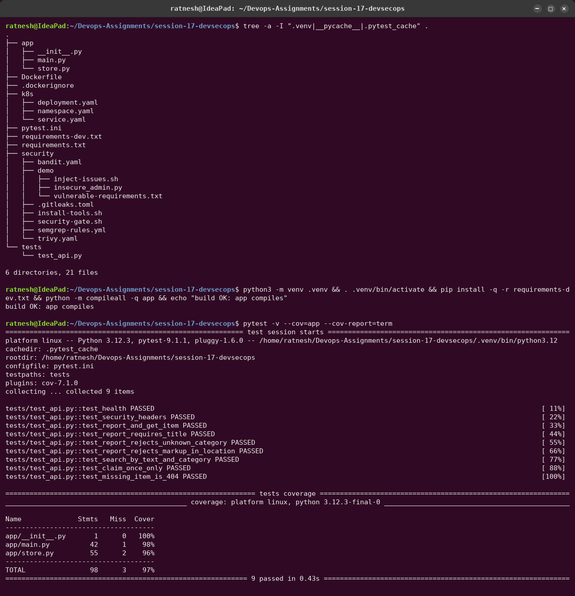

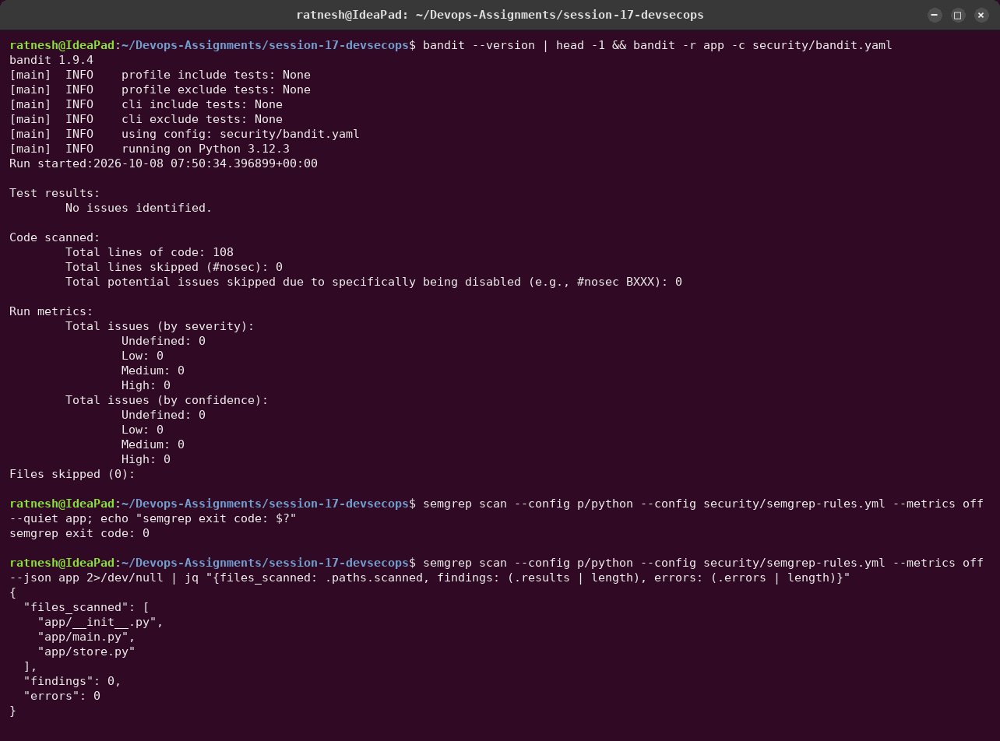

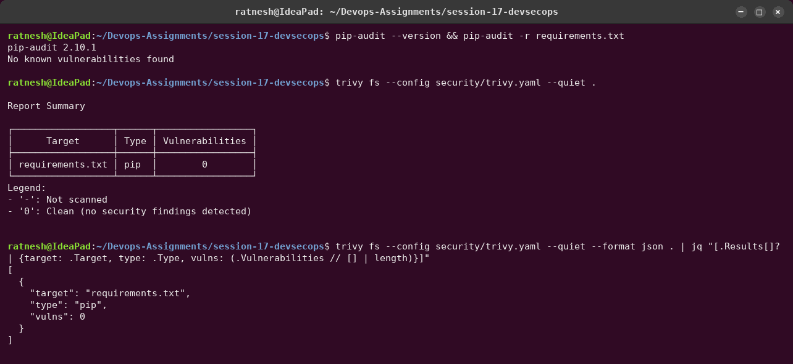

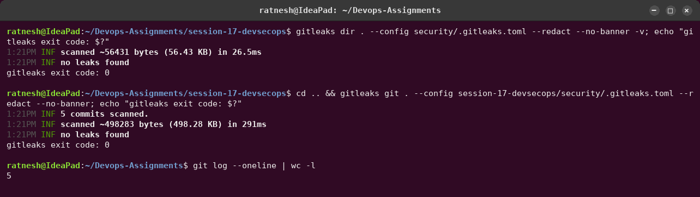

### Choosing the base image with the scanner

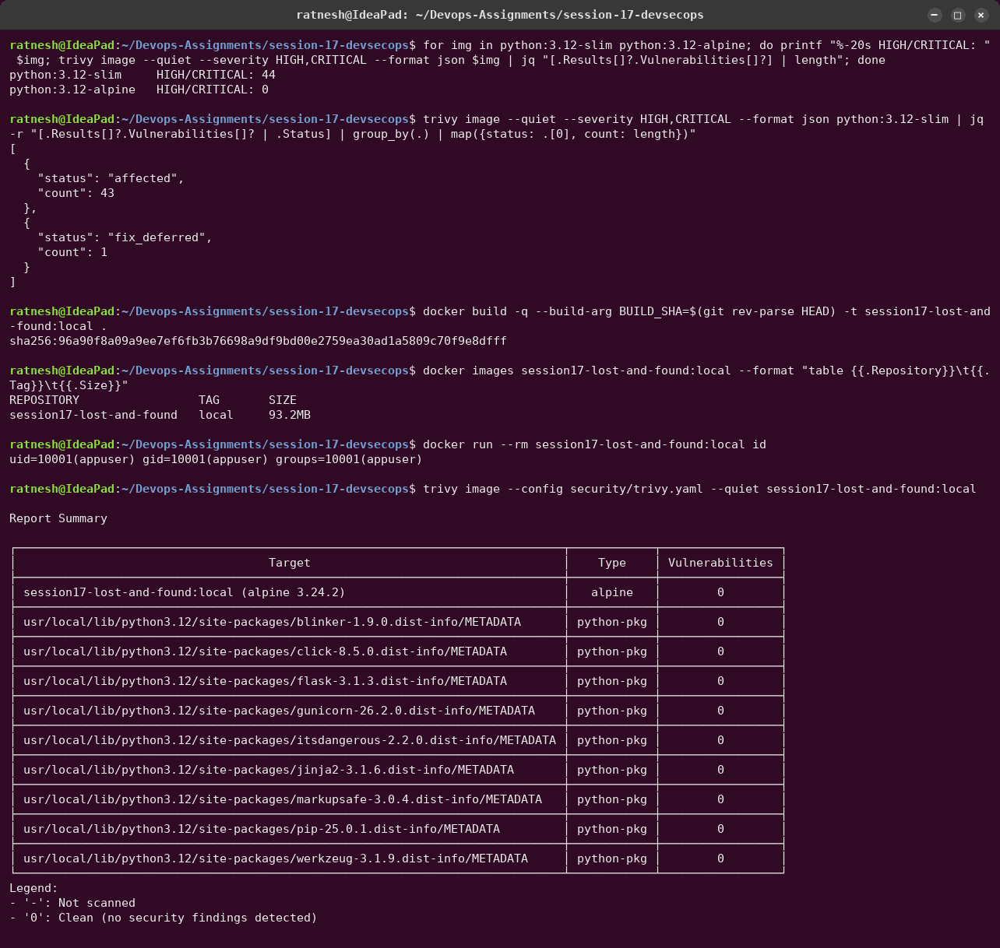

`python:3.12-slim` (Debian) carries **44 HIGH/CRITICAL CVEs**: 43 `affected` and 1
`fix_deferred`. Debian has not shipped fixes for any of them, so even a rebuild would not
clear them. `python:3.12-alpine` has **0**.
Because of this the gate can block on every HIGH/CRITICAL finding (`ignore-unfixed: false`)
instead of ignoring unfixed ones.

## 2. The security gate: passing, then blocking bad changes

[`security/scan-local.sh`](security/scan-local.sh) runs every scanner exactly as the pipeline
does and writes the same JSON reports.

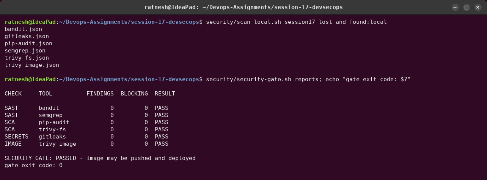

To prove the gate works, [`security/demo/inject-issues.sh`](security/demo/inject-issues.sh)
put one problem for every scanner into the **working tree** (never committed):

- `app/insecure_admin.py` with `shell=True`, `yaml.load`, MD5 for passwords, Flask
  `debug=True` on `0.0.0.0` ([source](security/demo/insecure_admin.py));
- old `PyYAML==5.3.1` and `requests==2.19.1` pins;
- a campus-portal token in `app/settings_local.py`, generated with `openssl rand` at demo
  time so no real-looking secret ever exists in the repository.

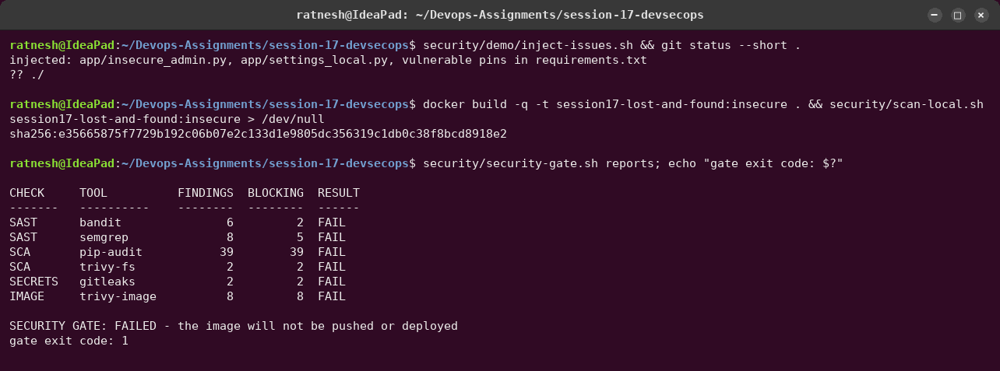


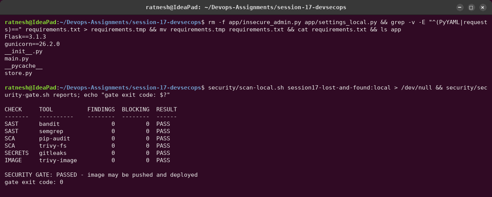

What it showed:

- **Defence in depth:** the leaked token was caught by **three** tools: Gitleaks (the custom
  `campus-portal-token` rule *and* the generic rule), Semgrep (project rule) and Bandit (B105,
  LOW). `requests 2.19.1` was caught by both pip-audit and Trivy. One tool missing a finding is
  not fatal.
- **SCA sees transitive dependencies:** pinning `requests` pulled in `urllib3 1.23` and
  `idna 2.7`, which were never listed but account for most of the 39 advisories.
- **Scanner reports leak secrets.** My first run of the "details" screenshot printed Bandit's
  `issue_text` for B105, which contains the token value itself. I deleted that transcript and
  re-recorded with a redaction filter, and the pipeline prints only the rule name, never
  `issue_text`. Scan reports are sensitive artifacts.

## 3. The pipeline (GitHub Actions, executed with act)

Run locally with [act](https://github.com/nektos/act), exactly as in Session 16 (local registry
instead of GHCR, lab cluster through the `KUBE_CONFIG` secret). On GitHub the same file pushes
to `ghcr.io` and deploys into a throw-away kind cluster.

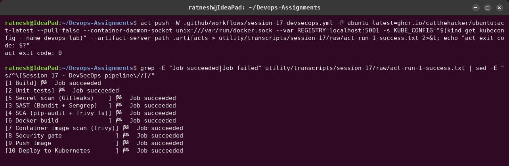

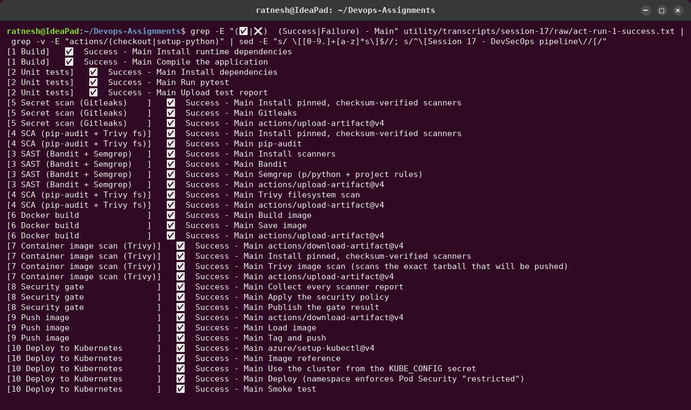


Full log: [`raw/act-run-1-success.txt`](../utility/transcripts/session-17/raw/act-run-1-success.txt) (1276 lines).
The image tag `48197fa…` is the commit that was scanned.

### The gate blocking a deployment in CI

The same injected issues, committed nowhere, run through the full pipeline:

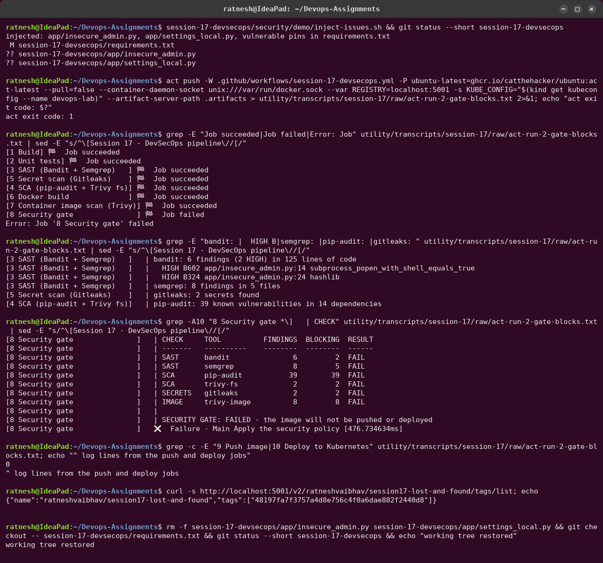

- Every scan job still **succeeded**: they only report. The **gate job failed** and stopped
  the run.
- `9 Push image` and `10 Deploy to Kubernetes` produced **0 log lines**: they never started.
  The registry still holds only the earlier, clean tag.
- Full log: [`raw/act-run-2-gate-blocks.txt`](../utility/transcripts/session-17/raw/act-run-2-gate-blocks.txt).
  It was checked with grep for the injected token value (0 hits).

## 4. What is running in the cluster


- `id` → `uid=10001(appuser)`; `touch /srv/app/hacked.py` → `Read-only file system`. Even
  code-execution inside the container cannot modify the app.
- Responses carry `X-Content-Type-Options: nosniff`, `X-Frame-Options: DENY` and a
  restrictive CSP; `<script>` in input is rejected by validation.
- `kubectl run` of a **privileged root Pod** is refused by the API server with six Pod Security
  violations (privileged, privilege escalation, capabilities, runAsNonRoot, runAsUser=0,
  seccomp). The cluster enforces the same rules as the pipeline.
