# Session 19 — Cloud & Terraform in Action

**Name:** Ratnesh Vaibhav  ·  **Roll No:** 24bcs10413

An end-to-end AWS environment for a small campus website, built, changed and destroyed with
Terraform: **VPC → subnets → security group → EC2 → S3**, plus the IAM role the server uses,
with the Terraform state kept remotely in S3 with locking.

## Architecture

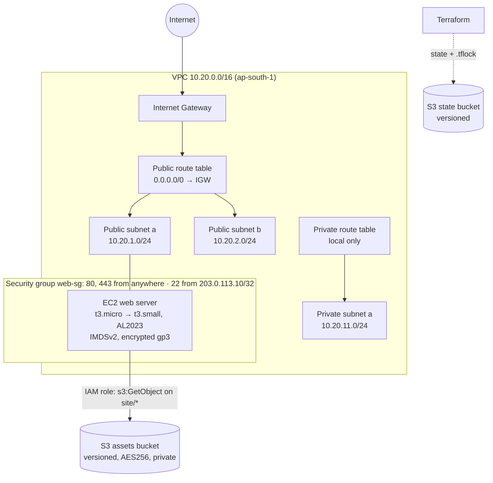

Terraform's own view, generated from the code with `terraform graph | dot -Tpng`
(an arrow means "depends on"):


## Project layout

```text
session-19-cloud-terraform/
├── bootstrap/create-state-bucket.sh   one-time: the S3 bucket that will hold the state (versioned, private)
├── diagrams/terraform-graph.png       generated by terraform graph
└── terraform/
    ├── versions.tf          required_version, required_providers (aws ~> 6.0, random ~> 3.7), backend "s3" {}
    ├── providers.tf         provider "aws" (region, default_tags, emulator switches) + provider "random"
    ├── variables.tf         region, project, owner, vpc_cidr, public/private subnet maps, instance_type (validated), admin_cidr
    ├── terraform.tfvars     values for this run
    ├── network.tf           VPC, IGW, public/private subnets (for_each), route tables + associations
    ├── security.tf          security group + one resource per ingress/egress rule
    ├── compute.tf           AMI data source, IAM role/policy/instance profile, EC2 with user_data
    ├── storage.tf           random_id, S3 bucket + versioning/encryption/public-access block + site object
    ├── user_data.sh         first-boot script (install nginx, copy the page from S3)
    ├── outputs.tf           vpc_id, subnet ids, sg id, ami_id, instance id, public ip, url, bucket
    ├── backend-emulator.hcl backend settings for the local emulator
    └── backend-aws.hcl.example  backend settings for real AWS
```

## The Terraform concepts, as used here

| Concept | In this project |
|---|---|
| **Providers** | two: `hashicorp/aws` v6.68.0 and `hashicorp/random` v3.9.1, both pinned in `.terraform.lock.hcl`; `terraform providers` lists them |
| **Variables** | typed (`string`, `map(string)`), defaults, a `validation` block on `instance_type`, values from `terraform.tfvars`, overridden once with `-var` |
| **Resources** | 23 resource blocks → 25 instances (`for_each` over the subnet maps) + 1 data source |
| **Outputs** | 9 outputs, read with `terraform output -raw` in the verification commands |
| **Dependencies** | *implicit*: every `aws_vpc.main.id` / `aws_s3_bucket.assets.arn` reference is a graph edge. *Explicit*: `depends_on` makes the instance wait for its page in S3 and for the public route, which `user_data` needs at boot but the code does not reference |
| **AWS infrastructure** | VPC, 3 subnets in 2 AZs, IGW, 2 route tables, SG + 4 rules, IAM role + inline policy + instance profile, EC2, S3 bucket + 3 settings + object |
| **Terraform state** | remote `s3` backend, `encrypt = true`, **`use_lockfile = true`** (S3-native locking, Terraform ≥ 1.10, no DynamoDB table); state versions kept by bucket versioning |
| **plan / apply / destroy** | `plan -out=tfplan` → `apply tfplan` (applies exactly what was reviewed) → change via `-var` → `destroy` |

## Where it ran

Like Session 18, all AWS calls went to the local **Moto** emulator
([`utility/aws-emulator/`](../utility/aws-emulator/)), because there are no AWS credentials on
this laptop. The API calls are real; no instance actually boots, so `user_data` never runs
and nothing listens on the public IP. To use real AWS: delete `aws_endpoint` from
`terraform.tfvars`, copy `backend-aws.hcl.example` to `backend-aws.hcl`, and
`terraform init -backend-config=backend-aws.hcl`.

---

## 1. Bootstrap the state bucket, `init`, `fmt`, `validate`

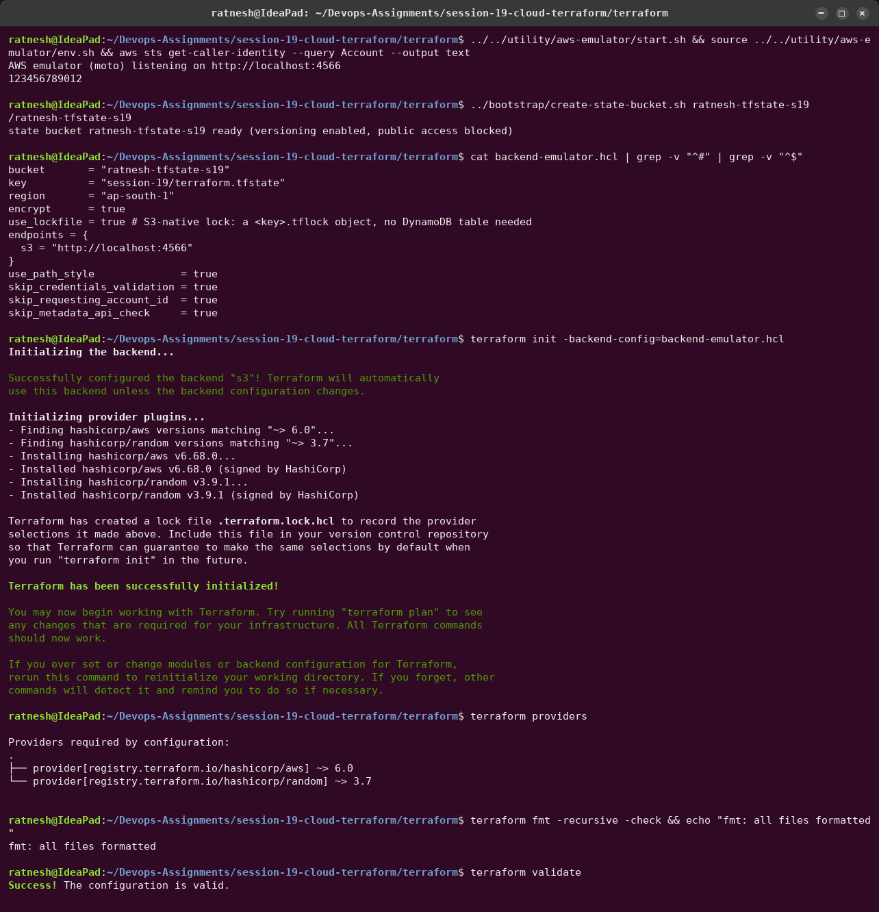

The state bucket is created **outside** Terraform: the backend must exist before `init`
can store anything in it. `init` printed `Successfully configured the backend "s3"!`.

## 2. `terraform plan`

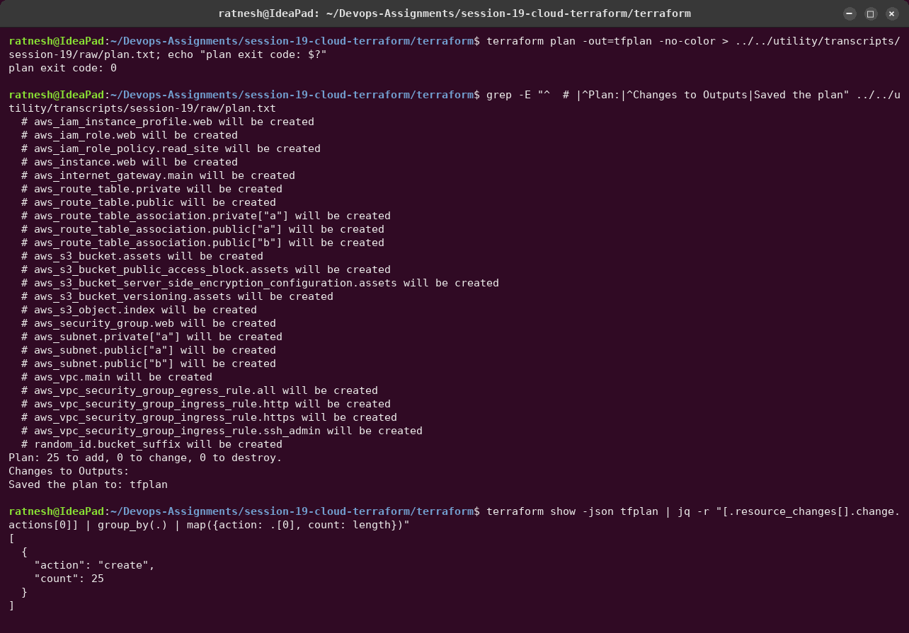

The plan is saved (`-out=tfplan`). The full text is kept in
[`raw/plan.txt`](../utility/transcripts/session-19/raw/plan.txt).
`terraform show -json tfplan | jq` turns the plan into data: 25 `create` actions, and nothing
to change or destroy.

## 3. `terraform apply tfplan`

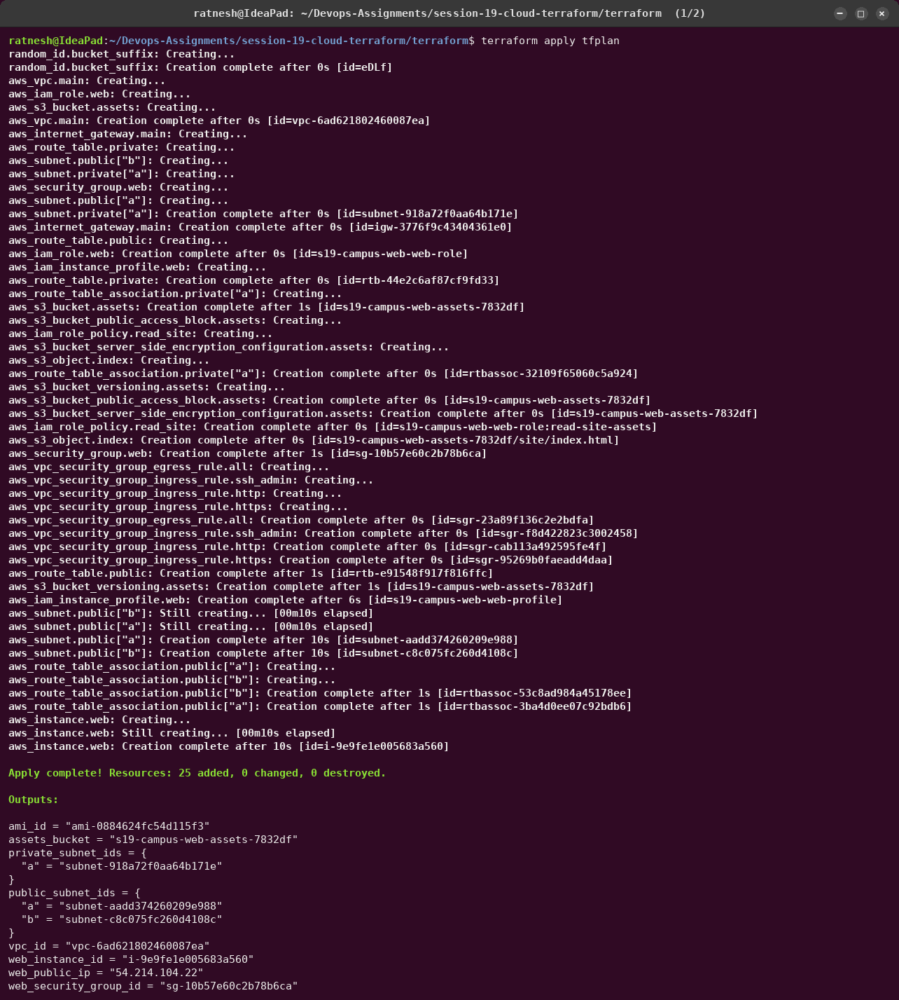
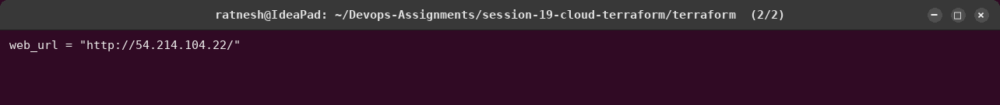

No approval prompt: applying a saved plan **is** the approval, and Terraform refuses to apply
it if the state changed since the plan was made. The creation order follows the graph above.
Independent branches (S3, IAM, networking) are created in parallel, and `aws_instance.web`
goes last.

## 4. Remote state


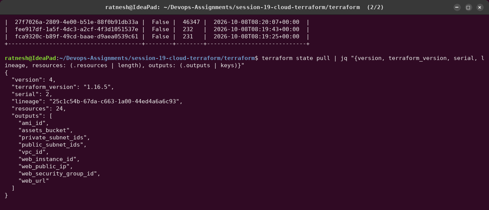

- No local `terraform.tfstate`: the state is `s3://ratnesh-tfstate-s19/session-19/terraform.tfstate`.
- **Four versions** of the state object: every write is kept, so a corrupted state can be
  rolled back to the previous version.
- `state pull`: format `version 4`, `serial` (incremented on each write), `lineage` (the
  unique id of this state's history), 24 resource *blocks* (`for_each` instances are grouped
  under one block).

### State locking


While one `terraform apply` waited at its approval prompt, a `terraform.tfstate.tflock`
object existed next to the state. A second `terraform plan` failed with **`Error acquiring
the state lock`**. S3 answered `412 PreconditionFailed` to the conditional `PutObject`, and
Terraform printed who holds the lock (`ratnesh@IdeaPad`, `OperationTypeApply`, time). When
the first run was cancelled the lock object disappeared. This prevents two people (or two
pipelines) from writing the state at the same time.

## 5. The dependency graph

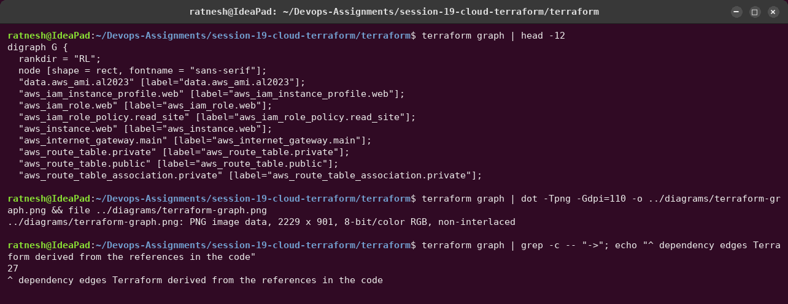

## 6. Verification with the AWS CLI


## 7. Changing the infrastructure

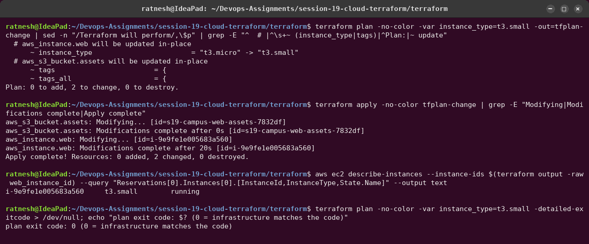

- `instance_type` is an **in-place** update (`~`): same instance ID, and the provider stops,
  modifies and starts it (20 s). Changing the AMI would instead be a **replacement**
  (`-/+`).
- The second change, `aws_s3_bucket.assets` tags, is the same emulator gap as in Session 18:
  provider v6 sets tags inside `CreateBucket`, which Moto ignores, so the first plan after
  creation adds them with `PutBucketTagging`. On real AWS this line would not appear.
- Afterwards `plan -detailed-exitcode` returns `0`: the infrastructure matches the code.

## 8. `terraform destroy`

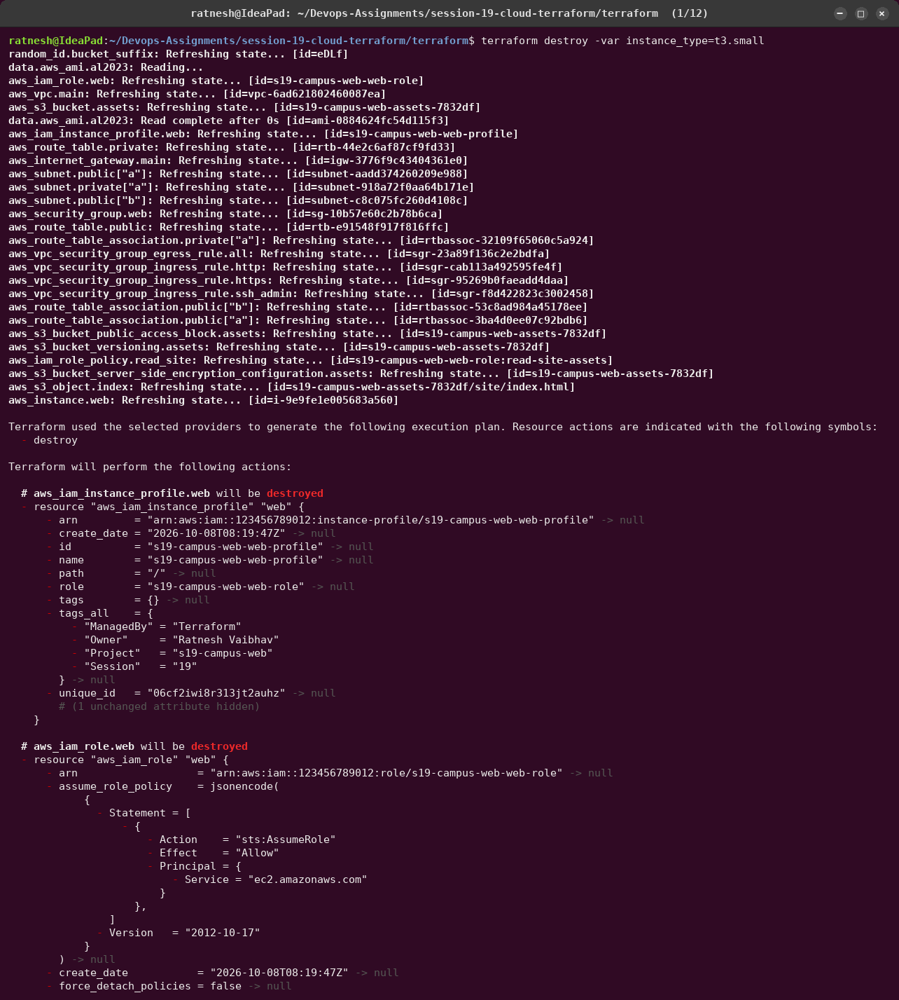
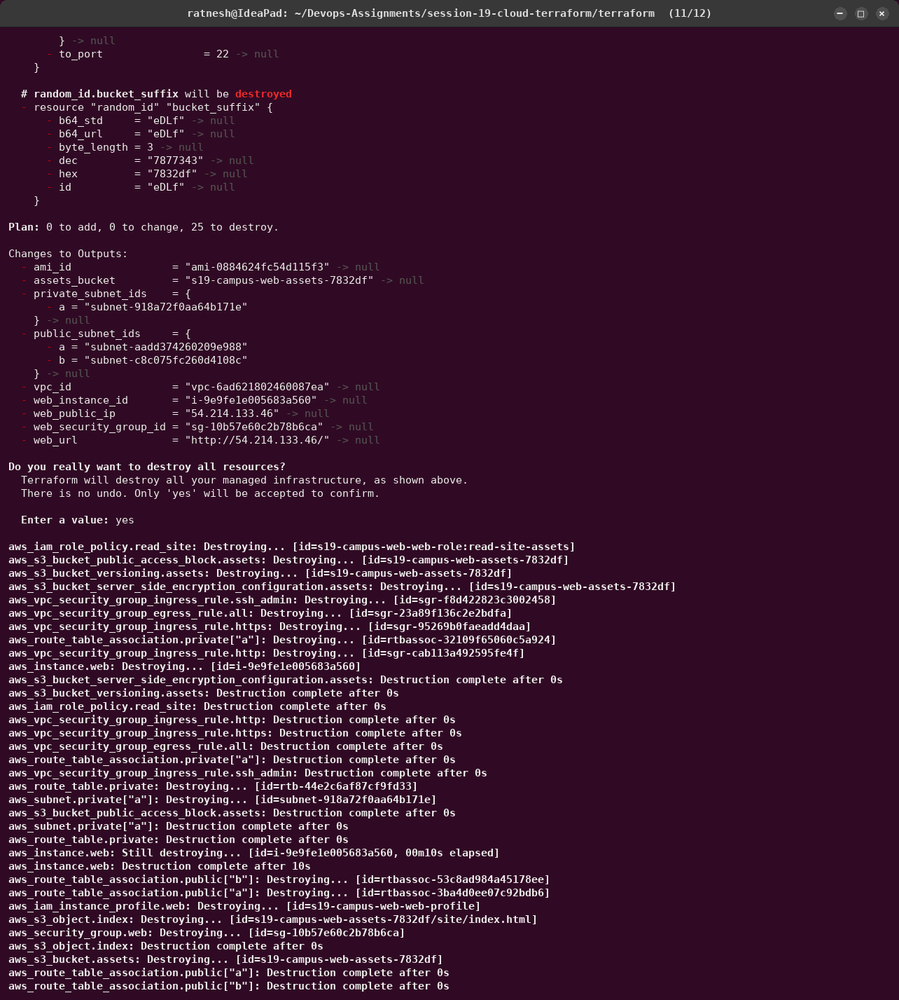
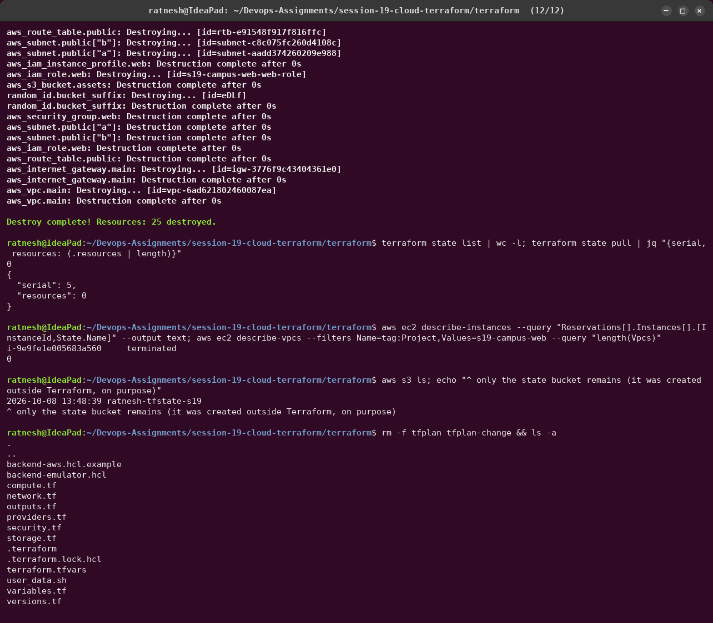

The destroy plan lists every attribute of all 25 resources, so the transcript is 12 pages long.
Pages 1, 11 and 12 are shown above; the full output is in
[`09_destroy.log`](../utility/transcripts/session-19/09_destroy.log) and pages 2–10 are in
[`utility/screenshots/session-19/`](../utility/screenshots/session-19/). Resources go in
reverse dependency order (instance first, VPC last). Afterwards the state has 0 resources
(its `serial` keeps counting up), and only the state bucket is left, deliberately, since it
was never managed by this configuration.

## Commands used

```bash
utility/aws-emulator/start.sh && source utility/aws-emulator/env.sh
session-19-cloud-terraform/bootstrap/create-state-bucket.sh ratnesh-tfstate-s19
cd session-19-cloud-terraform/terraform
terraform init -backend-config=backend-emulator.hcl
terraform providers
terraform fmt -recursive -check
terraform validate
terraform plan -out=tfplan
terraform apply tfplan
terraform state list / state show aws_instance.web / state pull
terraform graph | dot -Tpng -o ../diagrams/terraform-graph.png
terraform output -raw web_instance_id
terraform plan -var instance_type=t3.small -out=tfplan-change && terraform apply tfplan-change
terraform destroy                 # answer: yes
```

## Interview questions (from the course mini project)

1. **IaaS vs PaaS vs SaaS:** you manage the OS and up (EC2) / you manage only the app (Elastic
   Beanstalk, App Runner) / you just use the software (Gmail).
2. **Region vs AZ:** a region (`ap-south-1`, Mumbai) is a geographic area with several isolated
   data-centre groups, the AZs (`ap-south-1a`, `1b`, ...). Spreading subnets over AZs survives
   the loss of one.
3. **VPC vs subnet:** the VPC is the private network (`10.20.0.0/16`); a subnet is a slice of it
   (`10.20.1.0/24`) that lives in exactly one AZ.
4. **Public vs private subnet:** only the route table decides: a `0.0.0.0/0` route to an IGW
   makes it public.
5. **Route table:** rules for where traffic from a subnet goes (`local` within the VPC, IGW,
   NAT, peering).
6. **Internet Gateway:** the VPC's horizontally scaled door to the internet. It also does the
   1:1 NAT between an instance's private IP and its public IP.
7. **Security group:** a stateful, allow-only firewall attached to the instance's network
   interface.
8. **Terraform:** a declarative IaC tool. You describe the desired infrastructure in HCL and it
   computes and executes the API calls to get there.
9. **plan vs apply:** `plan` only computes and shows the diff between code, state and reality;
   `apply` executes it (optionally exactly a saved plan).
10. **terraform state:** Terraform's record of which real object belongs to which resource
    address, plus their attributes. It is what makes updates and destroys possible.
11. **terraform destroy:** plans the deletion of everything in the state, in reverse
    dependency order, and executes it after approval.
