# 01 — Monitoring demo

A small instrumented service, **campus-status**, is monitored on the kind cluster with the
**kube-prometheus-stack** (Prometheus Operator, Prometheus, Alertmanager, Grafana,
node-exporter, kube-state-metrics). The demo covers each item the task lists:

| Requirement | Shown by |
|---|---|
| **Metrics** | the app's `/metrics` endpoint, scraped every 15 s via a ServiceMonitor; PromQL over the HTTP API |
| **Logs** | one JSON line per request, filtered/aggregated with `kubectl logs` + `jq`, one request followed by its `request_id` |
| **Alerts** | 5 `PrometheusRule` alerts fired on purpose, routed by Alertmanager to a webhook receiver, then resolved |
| **CPU utilisation** | `container_cpu_usage_seconds_total` per pod vs its limit, `kubectl top`, the `CampusStatusHighCPU` alert |
| **Memory utilisation** | `container_memory_working_set_bytes` per pod vs its limit, `CampusStatusHighMemory` rule, Grafana panel |
| **Application health** | readiness/liveness probes, `up` (scrape health), `kube_deployment_status_replicas_available`, `CampusStatusUnavailable` |

```text
 campus-status pods ──/metrics──► Prometheus ──rules──► Alertmanager ──webhook──► alert-receiver (team "pager")
   │  JSON logs                    ▲   ▲    │                 ▲
   ▼                               │   │    └── PromQL ──► Grafana dashboard
 kubectl logs | jq     kube-state-metrics   node-exporter / kubelet cAdvisor
                       (replicas, limits)   (node + container CPU / memory)
```

## Files

| File | Purpose |
|---|---|
| [`app/main.py`](app/main.py) | Flask API; `prometheus_client` counter `http_requests_total{method,path,status}`, histogram `http_request_duration_seconds`, gauge `http_requests_in_flight`, info metric; JSON request logs; `/api/report?ms=` (CPU-heavy) and `/api/flaky?fail=1` (HTTP 500) to create incidents on demand |
| [`app/Dockerfile`](app/Dockerfile) | Alpine, non-root, gunicorn **1 worker × 8 threads** (`prometheus_client` keeps counters per process) |
| [`values/kube-prometheus-stack.yaml`](values/kube-prometheus-stack.yaml) | chart 92.1.0 values: ingresses on `*.localhost`, cluster-wide ServiceMonitor/rule discovery, kind-incompatible targets disabled, Alertmanager routing, Grafana anonymous viewer |
| [`k8s/app.yaml`](k8s/app.yaml) | namespace, Deployment (2 replicas, probes, limits 300m / 128Mi), Service |
| [`k8s/servicemonitor.yaml`](k8s/servicemonitor.yaml) | scrape `/metrics` of every Service endpoint every 15 s |
| [`k8s/prometheusrule.yaml`](k8s/prometheusrule.yaml) | 2 recording rules + 5 alerts (error rate, p95 latency, CPU, memory, unavailable) |
| [`k8s/grafana-dashboard.yaml`](k8s/grafana-dashboard.yaml) | dashboard ConfigMap ([JSON](dashboards/campus-status-dashboard.json)) picked up by Grafana's sidecar |
| [`k8s/traffic-generator.yaml`](k8s/traffic-generator.yaml) | synthetic users; `PHASE=normal|heavy|errors` changes the traffic mix |
| [`k8s/alert-receiver.yaml`](k8s/alert-receiver.yaml) | webhook endpoint that prints every notification it receives |
| [`scripts/watch-alert.sh`](scripts/watch-alert.sh) | polls the Prometheus API and prints an alert's state changes with timestamps |

---

## 1. Install the stack

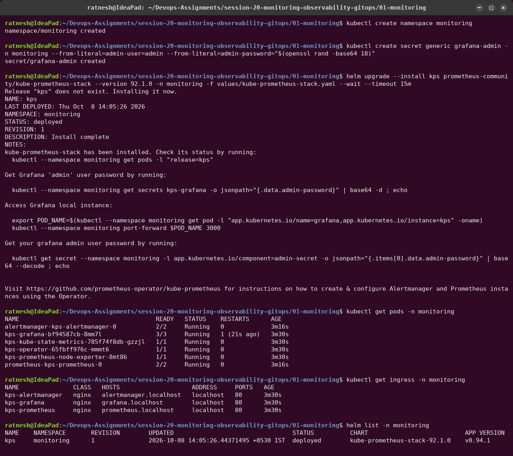

The Grafana admin password is generated with `openssl rand` into a Secret (`admin.existingSecret`)
and is never printed or committed. The UI is reachable read-only through anonymous Viewer access.

**First problem:** Grafana restarted. `describe` showed `OOMKilled`: Grafana 12 needs about
273Mi at start-up, above the 256Mi limit I had set. Raised it to 384Mi:

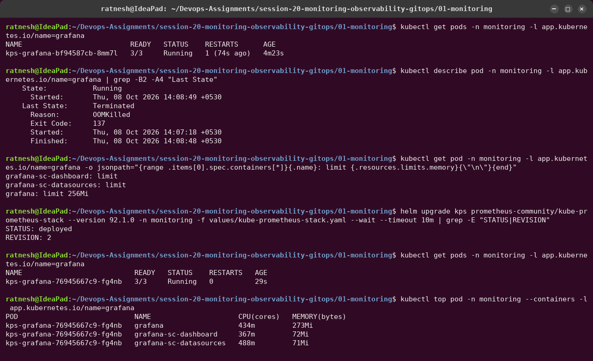

## 2. Deploy the app, check `/metrics`

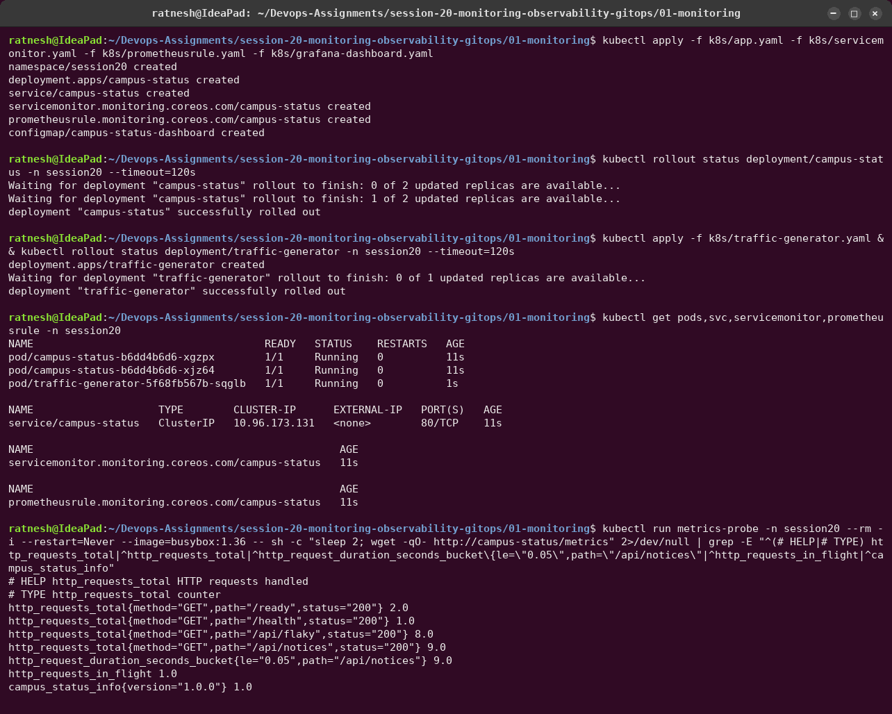

## 3. Metrics in Prometheus

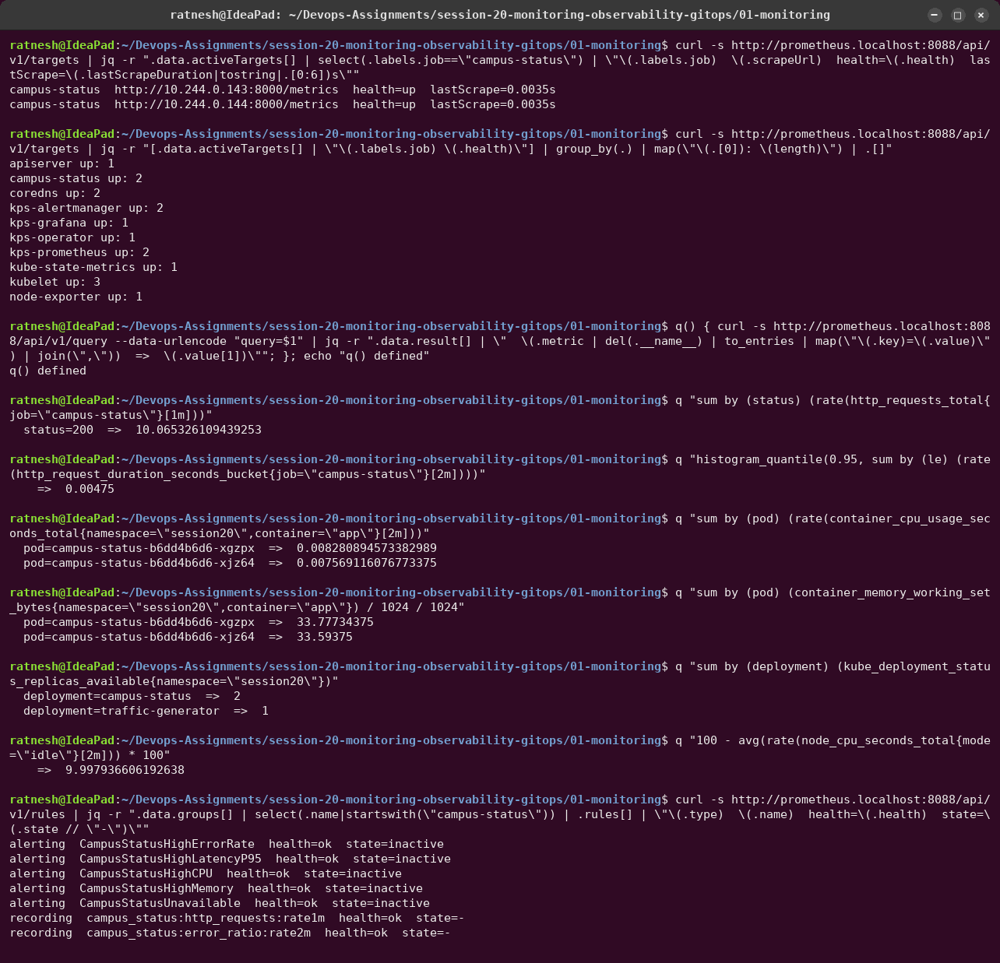

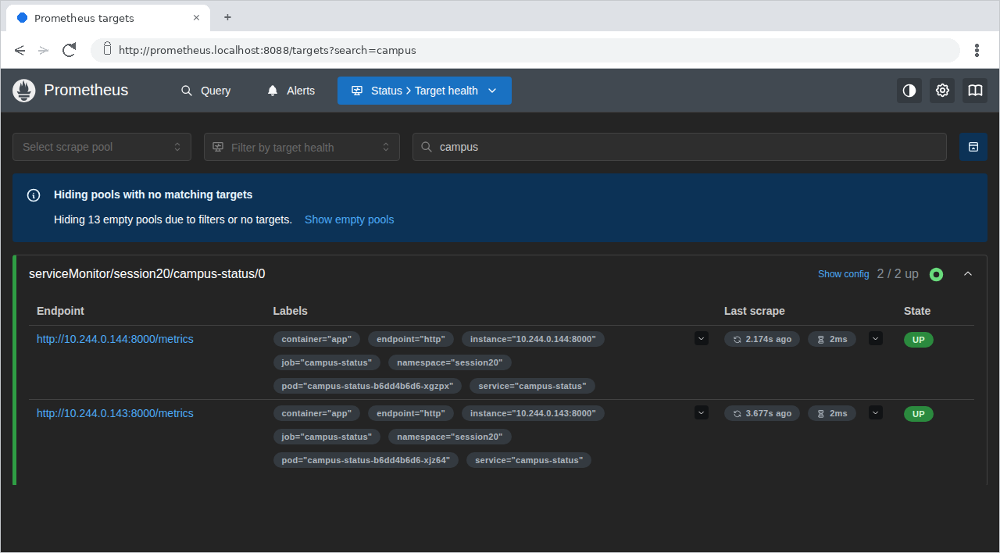

(The first try of this transcript ran too early: the targets were discovered but still
`health=unknown`, and `rate()` needs at least two samples, so two queries returned nothing.
Re-recorded after two minutes of scraping.)

### The dashboard, before any incident

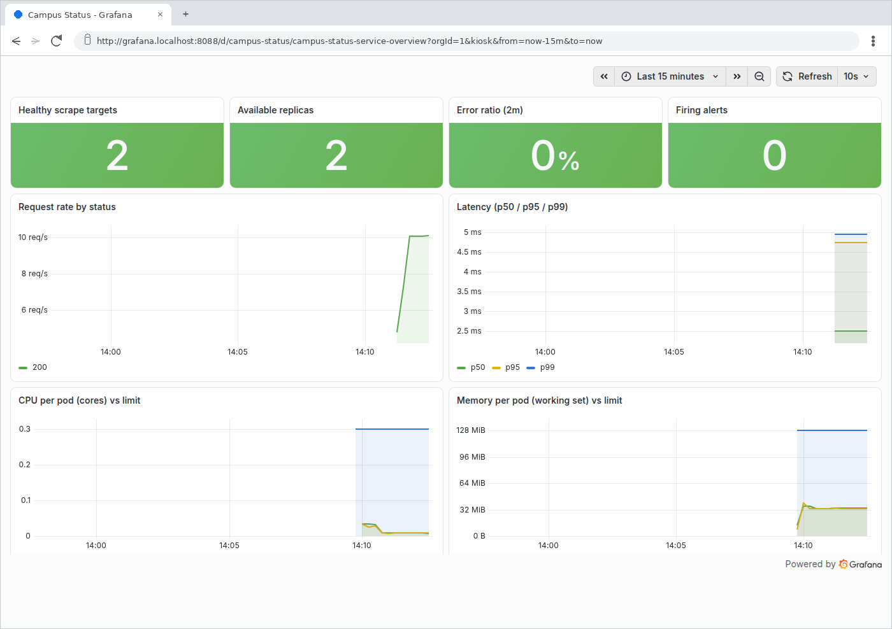

## 4. Alerts, triggered on purpose

### High error rate

`kubectl set env deployment/traffic-generator PHASE=errors` makes 1 in 3 requests fail.

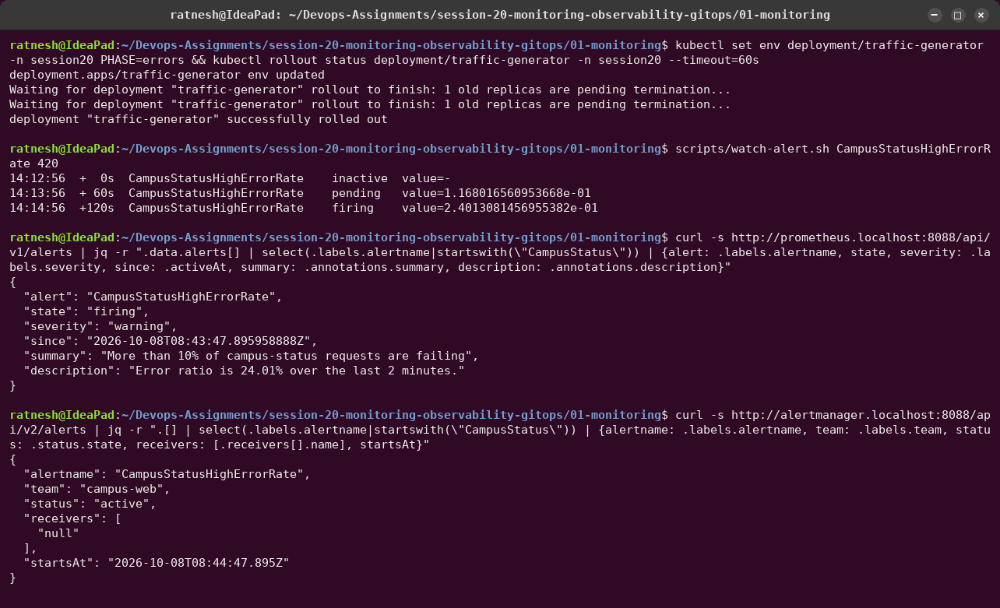

- `pending` once the expression is true, `firing` after the rule's `for: 1m`.
- Alertmanager received it but delivered it to the chart's default **`null`** receiver,
  i.e. nobody would be told. So I added a real route:

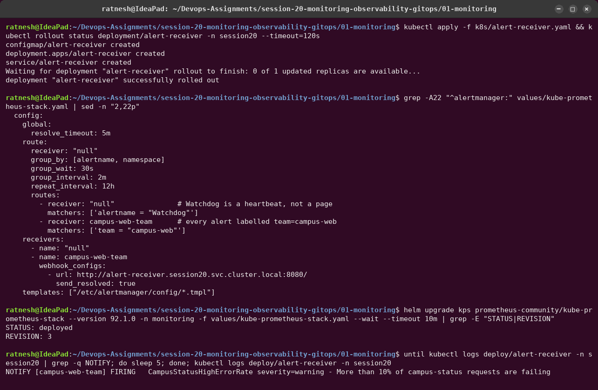

### Logs during the incident


Structured logs answer "what is failing?" in seconds: every 500 is on `/api/flaky`, half of its
calls fail, and a `request_id` leads to the exact pod and line. Gotcha I hit: with
`-l <selector>`, **`kubectl logs` keeps only the last 10 lines per pod** unless `--tail=-1` is
given. My first attempt mixed both and got contradicting counts.

### High latency and high CPU

`PHASE=heavy` sends CPU-heavy requests.

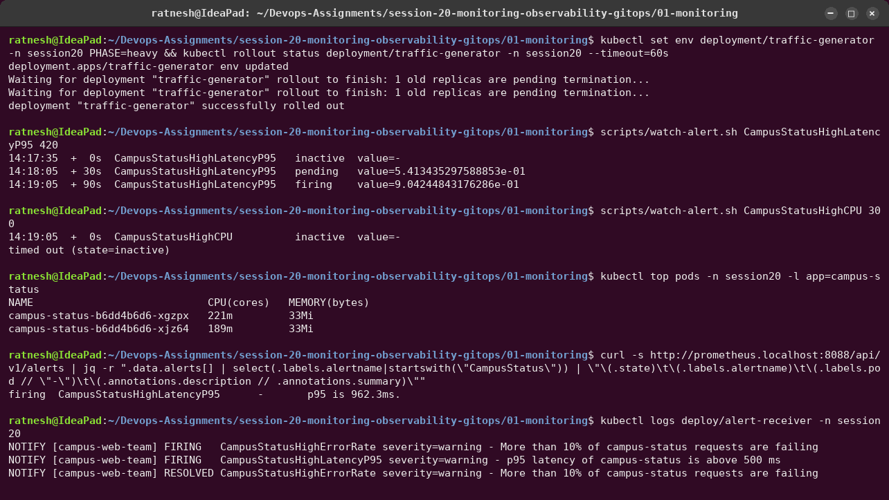

The error-rate alert **resolved** (and the receiver got the `RESOLVED` message). The CPU alert
correctly **did not** fire: 221m / 300m = 74 %, below the 80 % threshold. With three
generators:

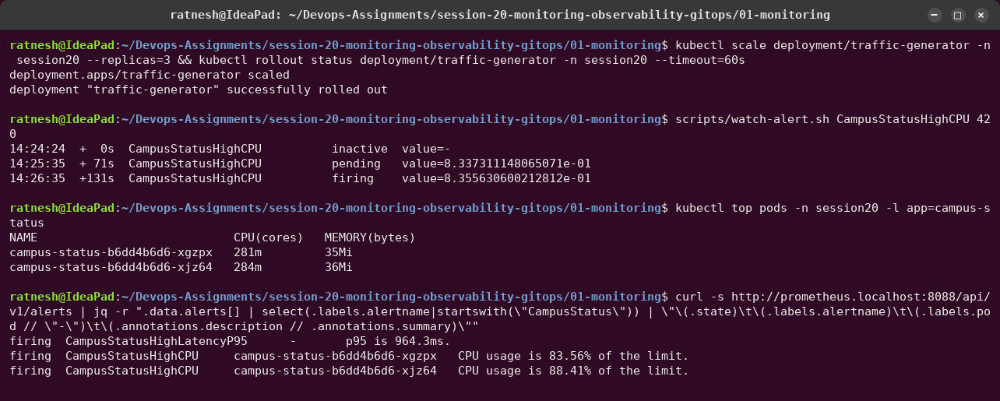

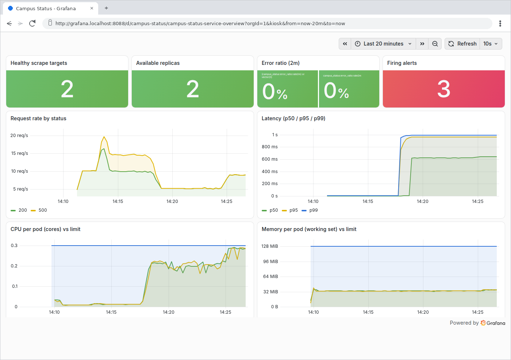

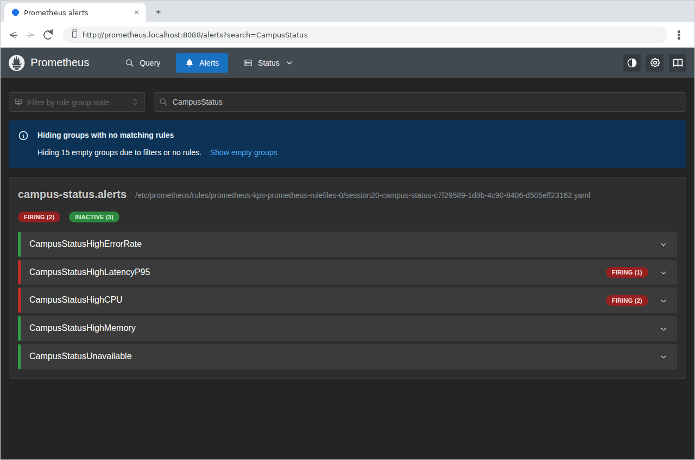
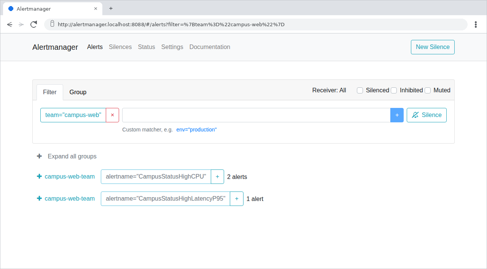

### Application down (critical)

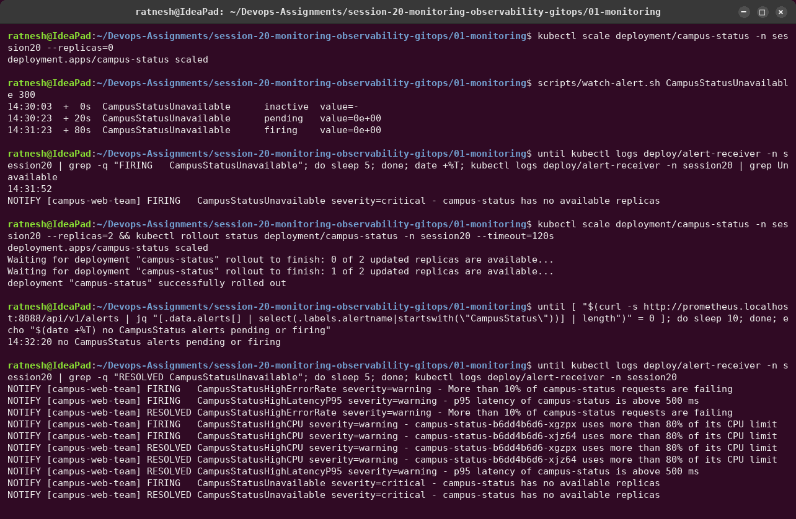

On the first try I restored the app seconds after the alert fired, and **no notification was
sent**. Alertmanager waits `group_wait` (30 s) before the first notification of a new group,
and the alert resolved inside that window. That is intended (it suppresses flapping), but it also
means a short outage can go un-paged. The recorded run waited for the page.

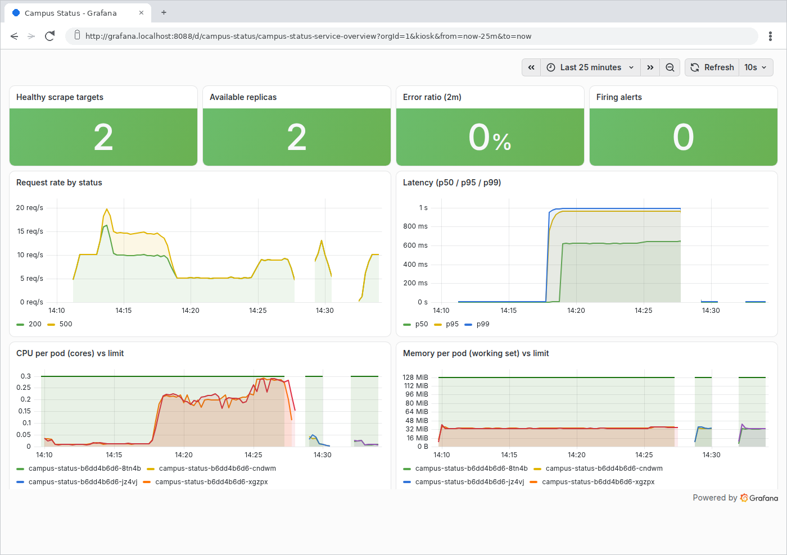

## Notes

- The "Error ratio" stat first showed two values: `campus_status:error_ratio:rate2m or
  vector(0)` keeps both series because the recorded series carries a metric name and
  `vector(0)` does not. Fixed with `sum(...) or vector(0)`.
- Memory budget: the Docker Desktop VM has 3.2 GiB. The bundled Kubernetes dashboards were
  disabled (`defaultDashboardsEnabled: false`), and for the GitOps part Grafana was scaled to
  0 temporarily (`kubectl scale deploy kps-grafana --replicas=0`; the next `helm upgrade`
  restores it).
