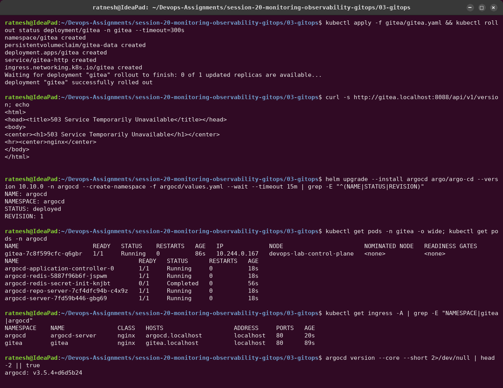
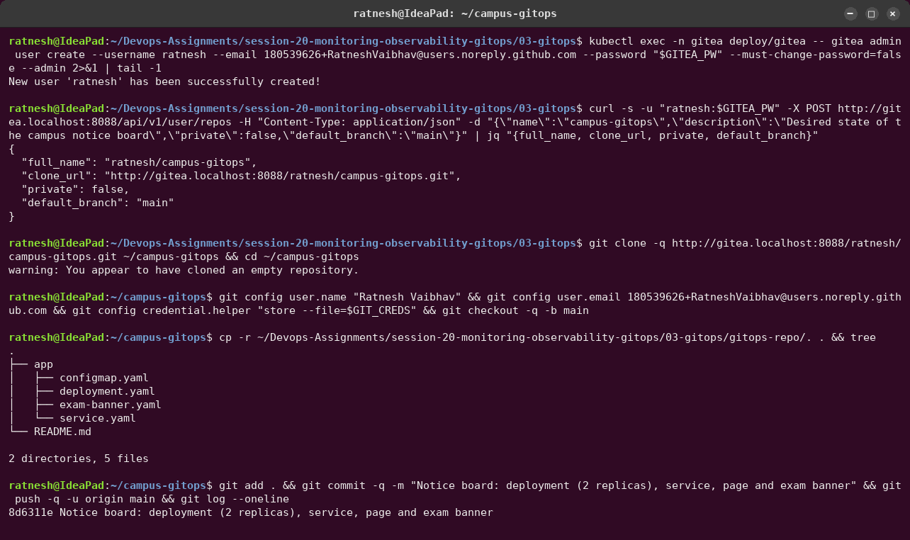
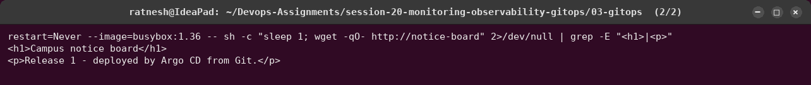
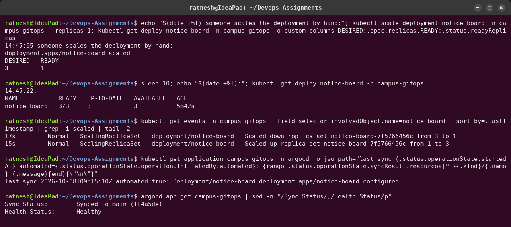
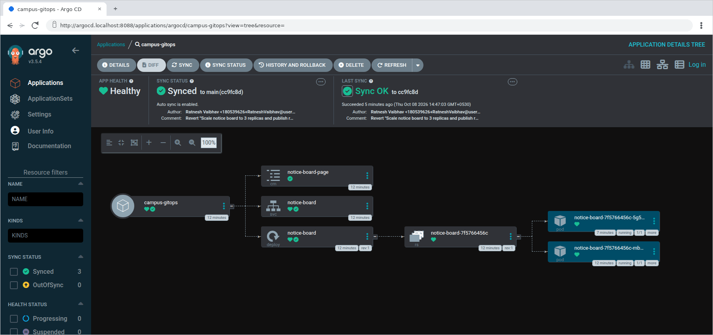
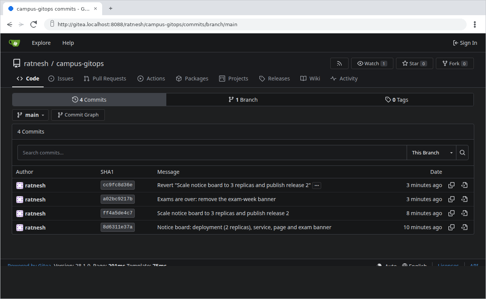
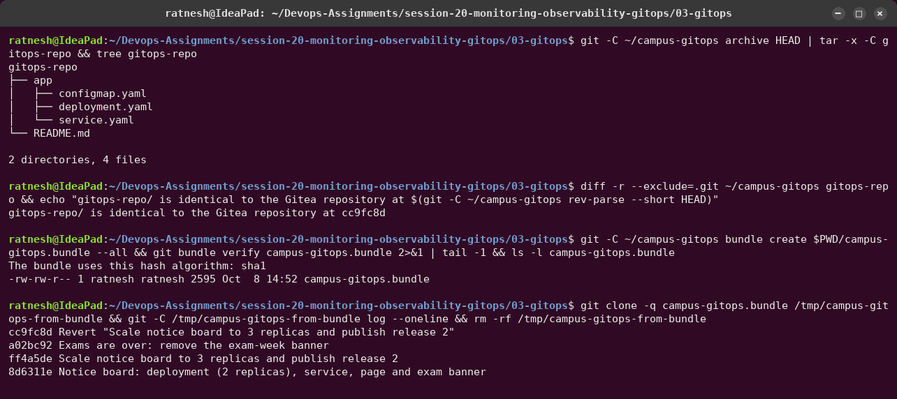

# 03 — GitOps demo with Argo CD

The concepts (GitOps principles, Git as source of truth, declarative configuration,
continuous reconciliation, workflow, Argo CD vs Flux) are written up in
[`CONCEPTS.md`](CONCEPTS.md). This page is the hands-on part: every claim there, shown on a
real cluster.

```text
 developer (laptop)                       kind cluster
 ~/campus-gitops ──git push──► Gitea  ◄──poll every 30 s── Argo CD ──apply / prune / self-heal──► namespace campus-gitops
  (working clone)              (Git server,                (application-controller,               notice-board Deployment,
                                ratnesh/campus-gitops)      repo-server, server)                   Service, ConfigMaps
```

**Why Gitea?** A GitOps agent needs a Git remote to watch. Gitea, a self-hosted Git server
deployed *inside* the cluster ([`gitea/gitea.yaml`](gitea/gitea.yaml)), plays the role of
GitHub, so the whole loop runs on the laptop and nothing is pushed to my real GitHub account.
To use GitHub instead, put the `app/` folder in a GitHub repository and change `repoURL` in
[`argocd/campus-gitops-app.yaml`](argocd/campus-gitops-app.yaml).

| File | Purpose |
|---|---|
| [`gitea/gitea.yaml`](gitea/gitea.yaml) | Gitea 28.1 (rootless, SQLite on a PVC), Service, Ingress `gitea.localhost` |
| [`argocd/values.yaml`](argocd/values.yaml) | argo/argo-cd 10.10.0 (Argo CD v3.5.4): Dex/notifications/ApplicationSet off, `timeout.reconciliation: 30s`, read-only anonymous UI, Ingress `argocd.localhost` |
| [`argocd/campus-gitops-app.yaml`](argocd/campus-gitops-app.yaml) | the `Application`: repo + path `app`, destination namespace, `automated: {prune, selfHeal}`, `CreateNamespace=true` |
| [`gitops-repo/`](gitops-repo/) | the GitOps repository's final content (identical to Gitea at `cc9fc8d`) |
| [`campus-gitops.bundle`](campus-gitops.bundle) | the repository **with its full history**: `git clone campus-gitops.bundle` |

---

## 1. Install Gitea and Argo CD



## 2. Create the Git repository and push the desired state



The Gitea password is random, kept in a private file, and appears only as `$GITEA_PW` /
`$GIT_CREDS` in the transcripts.

## 3. Register the Application (the only manual `kubectl apply`)




Argo CD created the namespace (`CreateNamespace=true`) and every object in `app/`. The synced
revision is exactly the commit at the head of `main`.

## 4. Change Git → the cluster follows


- Push at **14:41:40**, three replicas ready at **14:42:23**: 43 s, within the 30 s
  reconciliation interval plus rollout time. No `kubectl` was used.
- The new page text took another minute to appear. Argo CD updated the ConfigMap immediately,
  but the kubelet refreshes ConfigMap **volumes** on its own sync period (about 1 min), and
  the Pods were not restarted. For instant config changes, add a checksum annotation to the
  Pod template (as in the Session 15 notes chart) so a config change rolls the Pods.

## 5. Self-healing



Someone ran `kubectl scale --replicas=1`. Before the command even returned, Argo CD had
already put **desired = 3** back (the events show the scale-down and the scale-up two
seconds apart; the last sync is `automated=true`). The cluster cannot drift from Git.

## 6. Pruning and rollback by `git revert`


- **Prune:** deleting `exam-banner.yaml` from Git removed the ConfigMap from the cluster
  16 s later (`prune: true`). Without prune it would linger as an orphan.
- **Rollback = `git revert`:** reverting the "release 2" commit took the cluster back to 2
  replicas and the release 1 page, as a new, reviewable commit. Nobody needed cluster access.

## 7. The UI and the Git history







## Things I learned the hard way

- In Argo CD 3.x the per-resource health is no longer stored in `.status.resources[].health`
  (it is served from the resource tree), so `kubectl get application -o jsonpath` shows it
  empty. `argocd app get` shows it properly.
- `argocd --core` reads the namespace from the current kube context. Here the CLI talks to the
  API server through the ingress instead
  (`ARGOCD_OPTS="--server argocd.localhost:8088 --plaintext --grpc-web"`) with read-only
  anonymous access.
- The Argo CD UI keeps a server-sent-events stream open, which never lets headless Chrome's
  `--virtual-time-budget` finish. [`webshot.py`](../../utility/tools/webshot.py) gained a mode
  that drives Chrome over the DevTools protocol and captures once the page shows given text.
