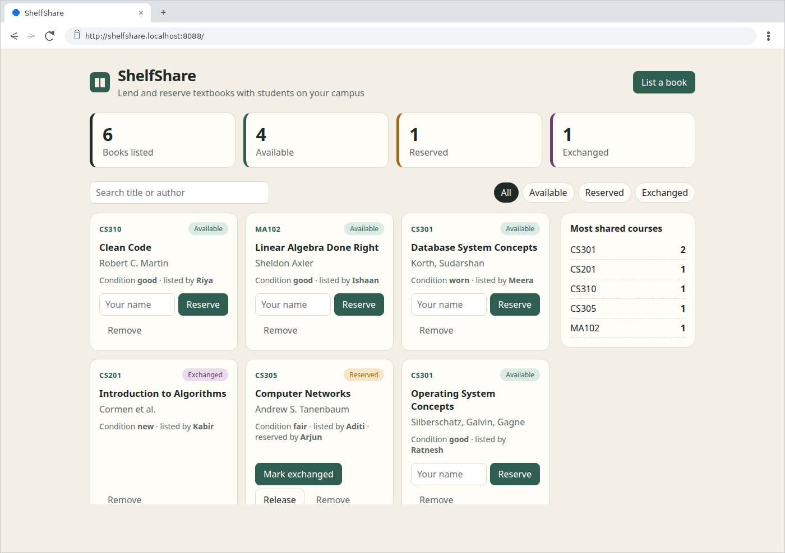

# Session 21 — Final DevOps Project & Troubleshooting

**Name:** Ratnesh Vaibhav  ·  **Roll No:** 24bcs10413

The project is **ShelfShare**, a campus textbook-exchange app (FastAPI + React + PostgreSQL),
taken through the whole chain the homework asks for:

```text
Application → Git → GitHub → CI pipeline → Build & Test → Security scanning → Docker image
→ Container registry → Kubernetes → Helm → Monitoring → GitOps        (+ Terraform for the cloud)
```

**Start here: [`final-devops-project/README.md`](final-devops-project/README.md).** It has
every required section (overview, architecture diagram, technologies, setup for each tool,
CI/CD, DevSecOps, monitoring, GitOps, troubleshooting, screenshots, lessons learned) with the
screenshots inline. The troubleshooting challenge has its own write-up in
[`final-devops-project/troubleshooting/README.md`](final-devops-project/troubleshooting/README.md).



## Homework checklist

| Required | Done in | Proof |
|---|---|---|
| **Infrastructure:** Terraform | [`terraform/`](final-devops-project/terraform/): VPC, 2 public + 2 private subnets, IGW, NAT, IAM, EKS 1.34 + node group | [plan/apply](../utility/screenshots/session-21/12_terraform_plan_apply_1.png), [verify/destroy](../utility/screenshots/session-21/13_terraform_verify_destroy_1.png) |
| **Kubernetes:** Deployment, Service, ConfigMap, Secret, Ingress, HPA, probes, storage | [`kubernetes/`](final-devops-project/kubernetes/) and the [Helm chart](final-devops-project/helm/shelfshare/) | [apply](../utility/screenshots/session-21/07_k8s_raw_apply_1.png), [restarts fixed](../utility/screenshots/session-21/08_k8s_raw_restarts_fixed.png), [data survives a DB pod delete](../utility/screenshots/session-21/09_k8s_raw_verify.png) |
| **Helm** | [`helm/shelfshare/`](final-devops-project/helm/shelfshare/) | [install + helm test](../utility/screenshots/session-21/10_helm_install.png), [upgrade](../utility/screenshots/session-21/11_helm_upgrade.png) |
| **CI/CD:** GitHub Actions, build, test, Docker build, image push, Kubernetes deployment | [`session-21-pipeline.yml`](../.github/workflows/session-21-pipeline.yml) (copy in [`final-devops-project/.github/workflows/`](final-devops-project/.github/workflows/pipeline.yml)) | [10 jobs green](../utility/screenshots/session-21/21_pipeline_run.png), [key outputs](../utility/screenshots/session-21/22_pipeline_key_outputs.png) |
| **DevSecOps:** SAST, SCA, secret scanning, image scanning, security gate | [`security/`](final-devops-project/security/) | [42 → 0 image CVEs](../utility/screenshots/session-21/14_frontend_image_cves.png), [gate](../utility/screenshots/session-21/15_security_gate_local.png) |
| **Monitoring:** metrics, logs | ServiceMonitor, alert rules and dashboard in the chart; [`monitoring/`](final-devops-project/monitoring/) | [stack + /metrics](../utility/screenshots/session-21/28_monitoring_stack.png), [PromQL + HPA](../utility/screenshots/session-21/29_traffic_promql_hpa.png), [Grafana](../utility/screenshots/session-21/web_07_grafana_dashboard_v2.png) |
| **GitOps workflow** | [`gitops/`](final-devops-project/gitops/): Argo CD Application, bootstrap, repo bundle | [CI commit rolled out by Argo CD](../utility/screenshots/session-21/23_gitops_cd.png), [Argo CD UI](../utility/screenshots/session-21/web_04_argocd_app_tree.png), [final state](../utility/screenshots/session-21/35_final_state_1.png) |
| **Troubleshooting challenge:** identify, investigate, root cause, fix, verify, document | [`troubleshooting/`](final-devops-project/troubleshooting/README.md) | 3 injected faults + 5 real incidents |
| **Folder structure + README** | [`final-devops-project/`](final-devops-project/) | `application/ docker/ kubernetes/ helm/ terraform/ .github/workflows/ security/ monitoring/ gitops/ README.md` |

## Highlights

- **One commit, traced end to end.** The pipeline built and scanned commit `1529548`, pushed
  both images tagged with the full SHA, and committed the tag to the GitOps repo as
  `shelfshare-ci`. Argo CD rolled it out, and the running backend reports
  `build: 15295481756c` on `/health`.
- **A real security finding:** 42 fixable HIGH/CRITICAL CVEs in the nginx base image, fixed
  in the Dockerfile and blocked by the gate from then on.
- **Troubleshooting with real stakes.** Three faults were injected through Git: a DB user
  rename, an Ingress host typo that Argo CD reported as Healthy, and an HPA without CPU
  requests. Five incidents happened on their own and were handled the same way: a frontend
  OOMKilled during the GitOps handover, an ingress webhook outage, a load test that took the
  node down, a dashboard that said 0, and Prometheus losing its history. All eight were
  root-caused, fixed (through Git where it was app config) and verified.
- **Environment, stated plainly:** AWS via a local emulator (Moto) because there are no AWS
  credentials on this laptop, and GitHub Actions run locally with act. Both run unchanged
  against the real services; see the [project README](final-devops-project/README.md#1-project-overview).

## Evidence

- Terminal screenshots: [`utility/screenshots/session-21/`](../utility/screenshots/session-21/)
  (`01`–`36`), each rendered from the transcript of the same name in
  [`utility/transcripts/session-21/`](../utility/transcripts/session-21/).
- Browser captures: `web_01`–`web_08` (Compose UI, Swagger, the UI through the Ingress,
  Argo CD, Gitea, and Grafana during and after the load-test incident).
- Long logs: [`raw/act-pipeline-run.txt`](../utility/transcripts/session-21/raw/act-pipeline-run.txt)
  (the full pipeline run), [`raw/terraform-plan.txt`](../utility/transcripts/session-21/raw/terraform-plan.txt).
