# ShelfShare — Final DevOps Project

**Name:** Ratnesh Vaibhav  ·  **Roll No:** 24bcs10413

ShelfShare is a small campus web app where students list textbooks they no longer need,
other students reserve them, and the owner marks them exchanged. The app is deliberately
simple. The project is everything around it: one commit travels **Git → CI → security gate →
registry → GitOps repository → Argo CD → Kubernetes**, is watched by Prometheus and Grafana,
and the cloud infrastructure it would run on (VPC + EKS) is written in Terraform.

Every screenshot below was produced on my laptop (`ratnesh@IdeaPad`) from a recorded run:
terminal screenshots are rendered from the transcripts in
[`utility/transcripts/session-21/`](../../utility/transcripts/session-21/), and `web_*`
images are headless-Chrome captures of the live UIs with their URL bar.

## Contents

1. [Project overview](#1-project-overview)
2. [Architecture](#2-architecture)
3. [Technologies used](#3-technologies-used)
4. [Repository layout](#4-repository-layout)
5. [Application setup](#5-application-setup)
6. [Docker setup](#6-docker-setup)
7. [Kubernetes deployment](#7-kubernetes-deployment)
8. [Helm deployment](#8-helm-deployment)
9. [Terraform infrastructure (VPC + EKS)](#9-terraform-infrastructure-vpc--eks)
10. [CI/CD pipeline](#10-cicd-pipeline)
11. [DevSecOps implementation](#11-devsecops-implementation)
12. [Monitoring](#12-monitoring)
13. [GitOps](#13-gitops)
14. [Troubleshooting](#14-troubleshooting)
15. [Screenshots](#15-screenshots)
16. [Lessons learned](#16-lessons-learned)

---

## 1. Project overview

| Requirement | Where it is | Evidence |
|---|---|---|
| FastAPI backend + React frontend + PostgreSQL with migrations | [`application/`](application/) | 10 pytest tests, 95 % coverage; Alembic migration `0001` |
| Dockerfiles (non-root, multi-stage frontend) + Compose | [`docker/`](docker/) | backend uid 10001, frontend uid 101, compose run with the full API flow |
| Kubernetes manifests | [`kubernetes/`](kubernetes/) | StatefulSet + PVC, probes, Ingress, HPA, data survives a DB pod delete |
| Helm chart (Ingress `/` → frontend, `/api` → backend, ≥ 2 replicas) | [`helm/shelfshare/`](helm/shelfshare/) | install, `helm test`, config-change upgrade |
| Terraform: VPC with 2 public subnets + EKS | [`terraform/`](terraform/) | plan/apply 22 resources, verified with the AWS CLI, destroy |
| CI/CD: pytest, frontend build, both images, SHA tags, Trivy | [`.github/workflows/pipeline.yml`](.github/workflows/pipeline.yml) | 10 jobs green, images tagged with the commit SHA |
| DevSecOps | [`security/`](security/) | 8 scans behind one gate; 42 fixable image CVEs found and fixed |
| Prometheus + Grafana, `/metrics` | [`monitoring/`](monitoring/), chart templates | ServiceMonitor, 4 alert rules, 12-panel dashboard, HPA 2 → 4 under load |
| GitOps | [`gitops/`](gitops/) | Argo CD deploys exactly the commit CI built; rollback and roll-forward by Git |
| Troubleshooting challenge | [`troubleshooting/`](troubleshooting/README.md) | 3 injected faults + 5 real incidents, each root-caused and fixed through Git |

**Environment honesty.** There are no AWS credentials on this laptop. Terraform and the AWS
CLI ran against a local AWS API emulator (Moto); removing `aws_endpoint` from
`terraform.tfvars` deploys the same code to real AWS. GitHub Actions workflows were executed
locally with **act**, which runs each job in a runner-like container; they run unchanged on
GitHub after a push. Kubernetes is a one-node **kind** cluster inside a 3.2 GiB Docker VM, a
limit that caused real incidents (section 14).

## 2. Architecture

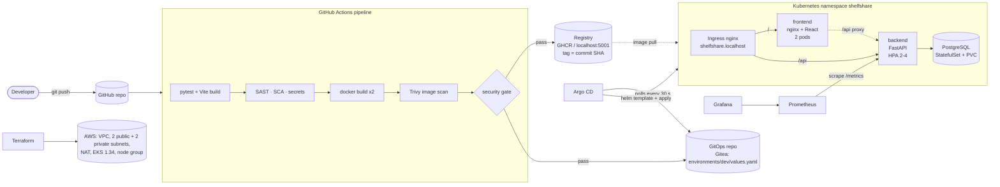
```mermaid
flowchart LR
  dev([Developer]) -- git push --> gh[(GitHub repo)]
  gh --> ci
  subgraph ci [GitHub Actions pipeline]
    direction TB
    t[pytest + Vite build] --> s[SAST · SCA · secrets]
    s --> b[docker build x2] --> sc[Trivy image scan] --> g{security gate}
  end
  g -- pass --> reg[(Registry<br/>GHCR / localhost:5001<br/>tag = commit SHA)]
  g -- pass --> gitops[(GitOps repo<br/>Gitea: environments/dev/values.yaml)]
  argo[Argo CD] -- polls every 30 s --> gitops
  argo -- helm template + apply --> k8s
  subgraph k8s [Kubernetes namespace shelfshare]
    direction LR
    ing[Ingress nginx<br/>shelfshare.localhost] -- "/" --> fe[frontend<br/>nginx + React<br/>2 pods]
    ing -- "/api" --> be[backend<br/>FastAPI<br/>HPA 2-4]
    fe -. /api proxy .-> be
    be --> pg[(PostgreSQL<br/>StatefulSet + PVC)]
  end
  reg -. image pull .-> k8s
  prom[Prometheus] -- scrape /metrics --> be
  graf[Grafana] --> prom
  tf[Terraform] --> aws[(AWS: VPC, 2 public + 2 private subnets,<br/>NAT, EKS 1.34, node group)]
```

**Request path:** browser → ingress-nginx → `/` frontend (nginx serving the React build) or
`/api` backend (FastAPI, 2+ replicas) → PostgreSQL. The backend's `/metrics` is only reachable
inside the cluster; Prometheus scrapes it through a ServiceMonitor.

**Delivery path:** CI never touches the cluster. After the gate passes it pushes both images
with tag = commit SHA and commits that tag to the GitOps repo. Argo CD notices the commit and
rolls it out. Rollback is a `git revert`.

## 3. Technologies used

| Area | Choice | Why |
|---|---|---|
| Backend | Python 3.12, FastAPI, SQLAlchemy 2, Alembic, psycopg 3, Pydantic 2 | typed request validation, OpenAPI docs for free, real migrations |
| Frontend | React 19, Vite 8 | fast build into static files served by nginx |
| Database | PostgreSQL 17 | StatefulSet with a PVC; SQLite only in unit tests |
| Containers | Docker, multi-stage builds, Docker Compose | `python:3.12-alpine`, `node:24-alpine` → `nginx-unprivileged` |
| Orchestration | Kubernetes 1.37 (kind), ingress-nginx, metrics-server | |
| Packaging | Helm 4 | one chart for dev/prod, `helm test` |
| Infrastructure | Terraform 1.16, AWS provider (VPC, EKS, IAM) | |
| CI/CD | GitHub Actions (run locally with act 0.2.89) | |
| Security | Bandit, Semgrep, pip-audit, npm audit, Trivy, Gitleaks, Pod Security `restricted` | |
| Observability | prometheus-fastapi-instrumentator, kube-prometheus-stack 92.1, Grafana | |
| GitOps | Argo CD 3.5.4, Gitea 28.1 (in-cluster Git server) | |

## 4. Repository layout

```text
final-devops-project/
├── application/
│   ├── backend/        FastAPI app (app/), Alembic migrations, pytest suite
│   └── frontend/       React + Vite single-page app
├── docker/             backend.Dockerfile, frontend.Dockerfile, nginx template, docker-compose.yml
├── kubernetes/         plain manifests + kustomization (namespace shelfshare-raw)
├── helm/shelfshare/    the chart: app, Postgres, Ingress, HPA, ServiceMonitor, alerts, dashboard, test
├── terraform/          VPC, subnets, NAT, IAM, EKS cluster + node group
├── .github/workflows/  pipeline.yml (copy; GitHub runs ../../.github/workflows/session-21-pipeline.yml)
├── security/           scanner configs, pinned tool installer, security-gate.sh, scan-local.sh
├── monitoring/         kube-prometheus-stack values, traffic.sh load generator
├── gitops/             Argo CD Application, dev environment values, bootstrap.sh, repo bundle
├── troubleshooting/    fault files, inject.sh, the full troubleshooting write-up
└── README.md
```

## 5. Application setup

| Endpoint | Purpose |
|---|---|
| `GET /api/books?status=&q=&course=` | list and search listings |
| `POST /api/books` | list a book (course code validated as `CS301`-style) |
| `GET/PUT/DELETE /api/books/{id}` | read, update (e.g. mark exchanged), remove |
| `POST /api/books/{id}/reserve` | reserve; `409` if it is not available |
| `GET /api/books/stats` | totals by status, most shared courses |
| `GET /health`, `GET /ready` | liveness (process) and readiness (database reachable) |
| `GET /metrics` | Prometheus metrics: request rate/latency by handler and status, `shelfshare_books_listed_total`, `shelfshare_books_reserved_total` |

Configuration comes from environment variables (`DB_HOST`, `DB_PORT`, `DB_NAME`, `DB_USER`,
`DB_PASSWORD`, `CORS_ORIGINS`, `LOG_LEVEL`); see
[`application/backend/.env.example`](application/backend/.env.example). Logs are one JSON
object per request.

```bash
cd application/backend
python3 -m venv .venv && . .venv/bin/activate && pip install -r requirements-dev.txt
pytest -v --cov=app                      # tests use SQLite, no database needed
cd ../frontend && npm ci && npm run build
```

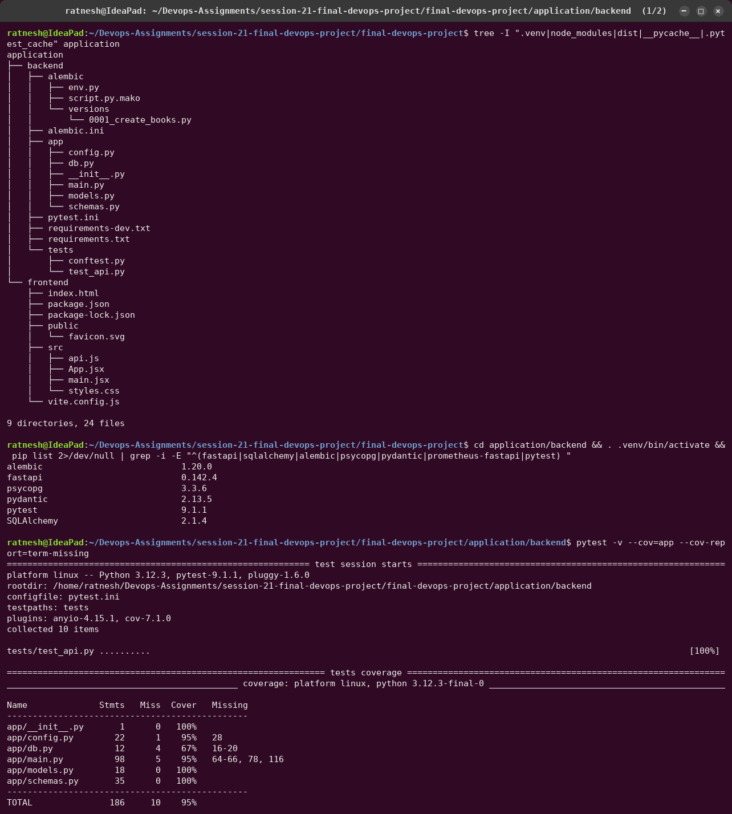
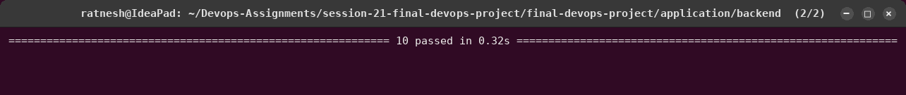
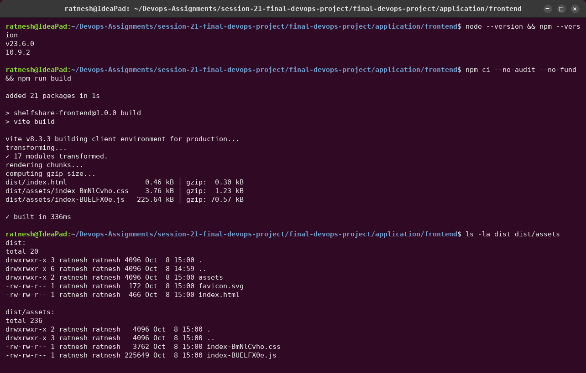

## 6. Docker setup

- [`backend.Dockerfile`](docker/backend.Dockerfile): two stages (wheels built in a builder,
  copied into a clean `python:3.12-alpine`), runs as **uid 10001**, and starts with
  `alembic upgrade head` before uvicorn (the migration takes a Postgres advisory lock, so
  replicas starting together cannot race).
- [`frontend.Dockerfile`](docker/frontend.Dockerfile): **multi-stage**: `node:24-alpine`
  builds the static files, `nginxinc/nginx-unprivileged` serves them as **uid 101** on port
  8080 and proxies `/api/` to `$BACKEND_URL`.
- [`docker-compose.yml`](docker/docker-compose.yml): Postgres with a health check, the
  backend waits for it, the frontend waits for the backend's `/ready`. The DB password
  comes from `docker/.env` (git-ignored), never from the file.

```bash
cd docker && cp .env.example .env    # then set DB_PASSWORD
docker compose up --build -d         # UI http://localhost:3000, API docs http://localhost:8000/docs
```

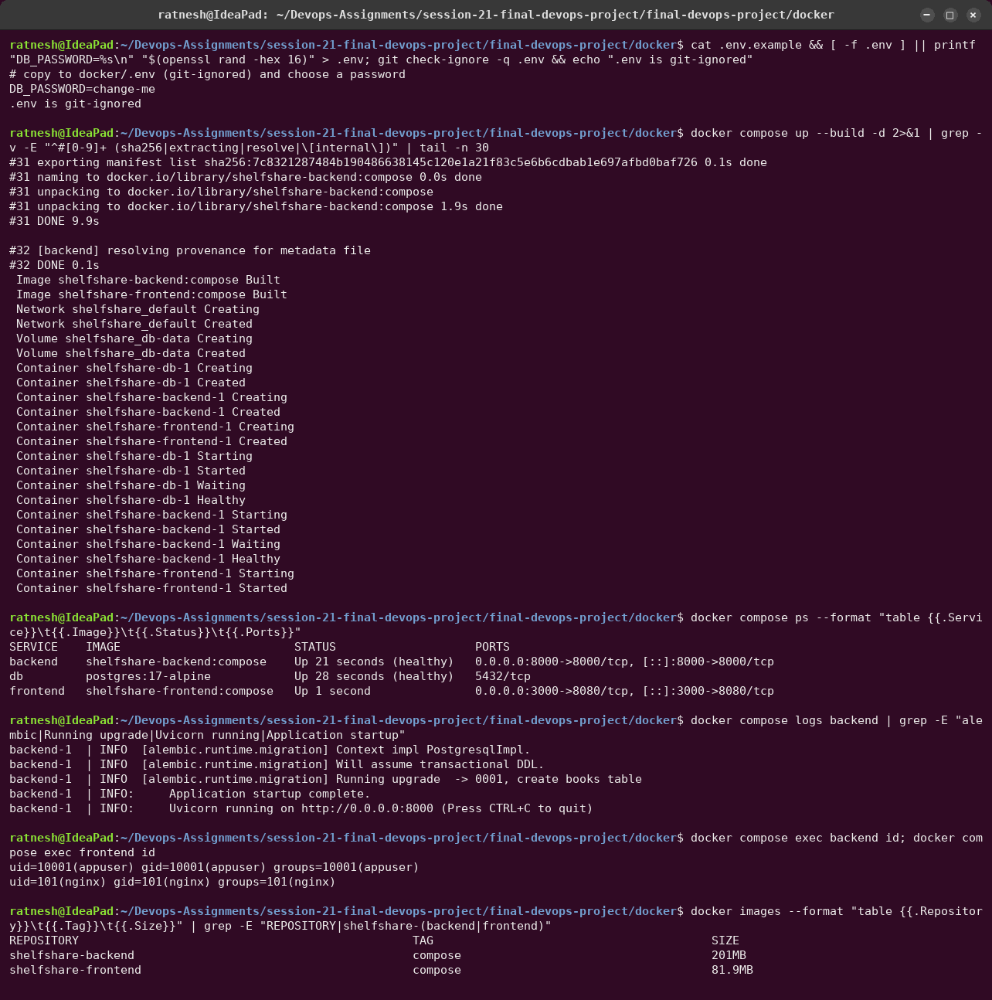

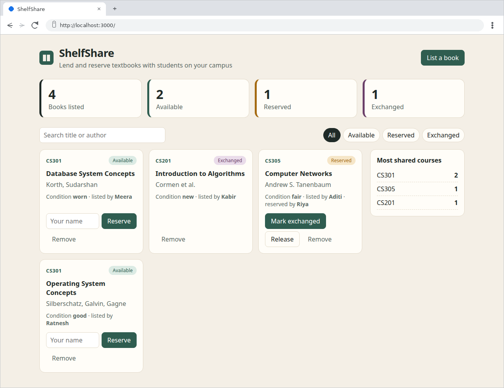
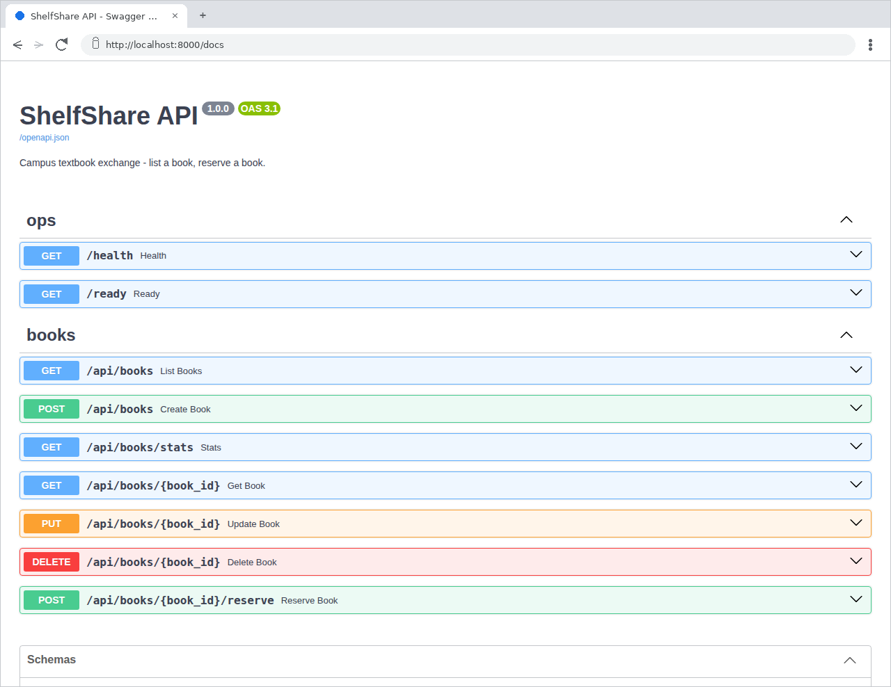
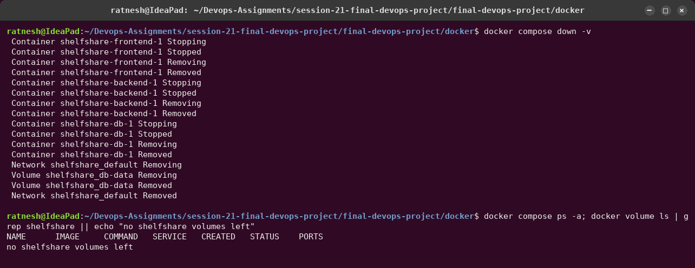
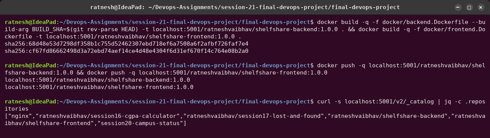

## 7. Kubernetes deployment

Plain manifests in [`kubernetes/`](kubernetes/), applied with Kustomize into namespace
`shelfshare-raw`: Namespace, ConfigMap, Secret (generated from the git-ignored `db.env`),
Postgres **StatefulSet** with a headless Service and a `volumeClaimTemplate`, backend and
frontend Deployments (2 replicas each, startup/readiness/liveness probes, requests and
limits, restricted security context), Ingress, and an HPA (2–4 replicas at 70 % CPU).

```bash
printf "password=%s\n" "$(openssl rand -hex 16)" > kubernetes/db.env
kubectl apply -k kubernetes
```

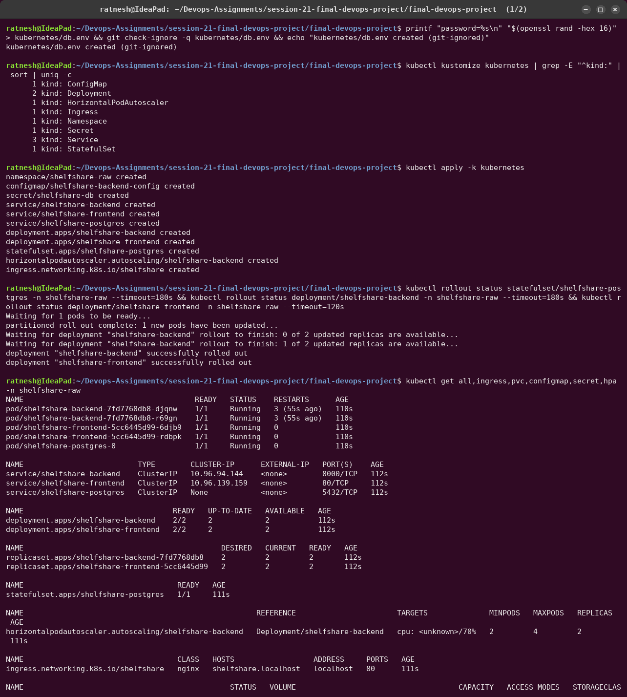
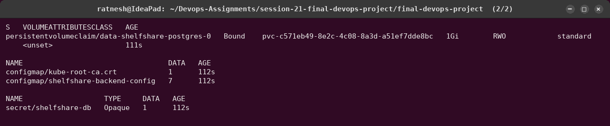

The first rollout had **backend restarts**: the backend started before the Postgres headless
Service had a ready endpoint, so the migration failed and the container exited. I added a
`wait-for-db` init container (`pg_isready` loop). After that, zero restarts:

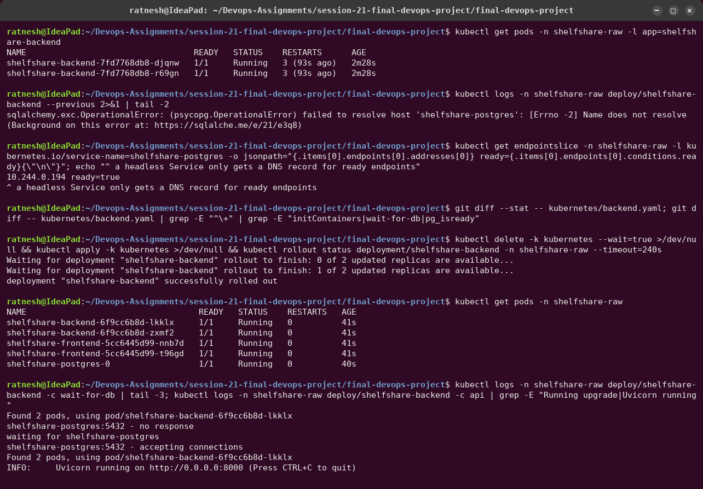
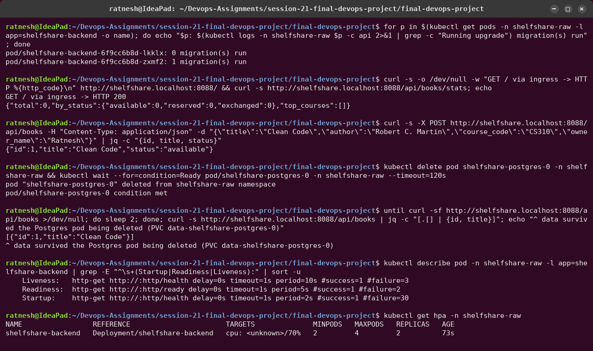
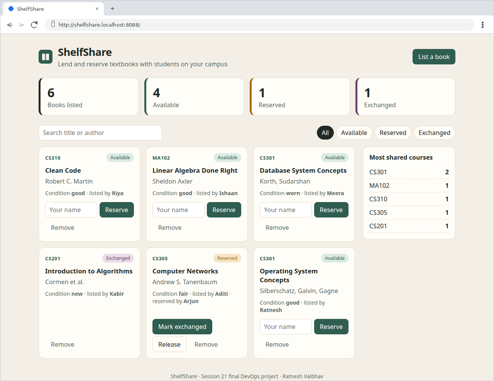

## 8. Helm deployment

[`helm/shelfshare`](helm/shelfshare/) packages the same app with everything configurable:

- **Ingress** `shelfshare.localhost`: `/api` → backend Service, `/` → frontend Service.
- **Backend**: HPA 2–4 replicas (so never fewer than 2), the `wait-for-db` init container, and
  a `checksum/config` annotation so a config change restarts the pods.
- **Frontend**: 2 replicas, nginx worker count tuned to the CPU limit.
- **Postgres**: StatefulSet + PVC; the password comes from an existing Secret
  (`database.existingSecret`) and is never in values or Git.
- **Monitoring**: ServiceMonitor, PrometheusRule (4 alerts) and a Grafana dashboard ConfigMap,
  each switchable.
- **`helm test`**: a restricted busybox Pod that calls the backend's `/ready` and the frontend's
  `/healthz`.
- `values-dev.yaml` (lab registry, debug logs) and `values-prod.yaml` (GHCR, 3+ replicas,
  bigger limits, `gp3` storage, a real hostname).

```bash
kubectl create namespace shelfshare
kubectl create secret generic shelfshare-db -n shelfshare --from-literal=password="$(openssl rand -hex 16)"
helm upgrade --install shelfshare helm/shelfshare -n shelfshare -f helm/shelfshare/values-dev.yaml --wait
helm test shelfshare -n shelfshare
```

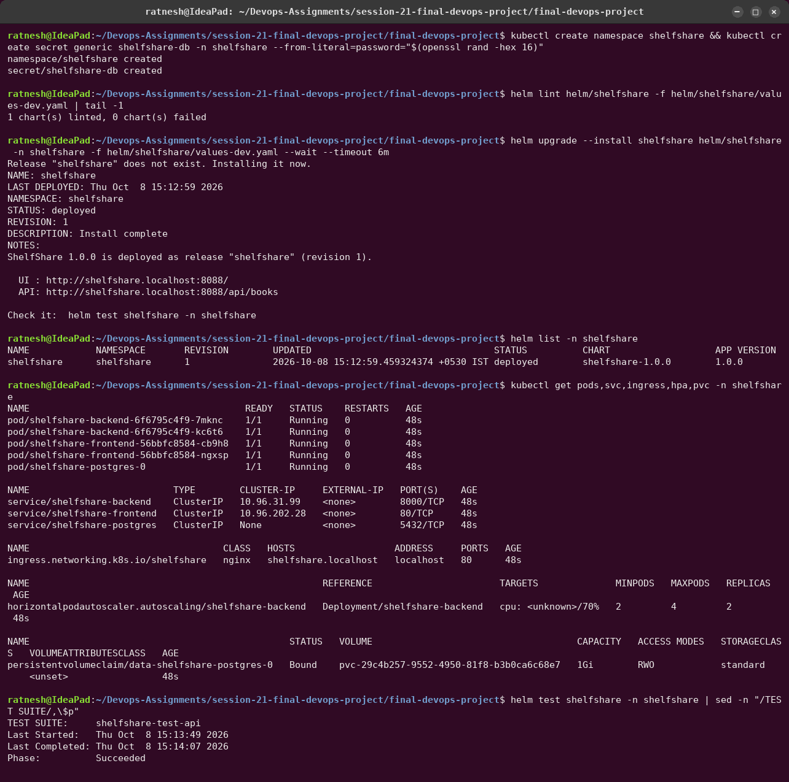
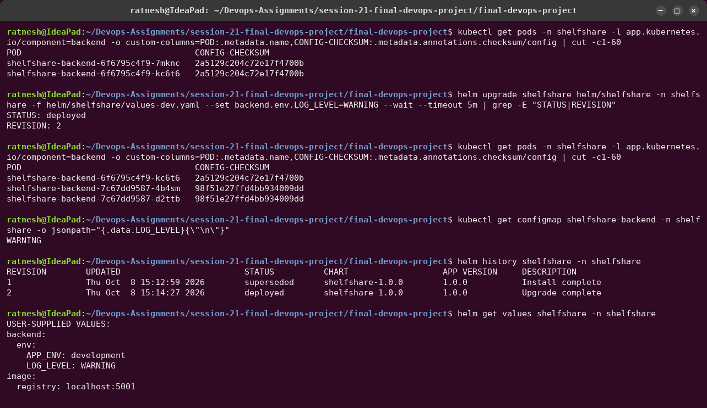

## 9. Terraform infrastructure (VPC + EKS)

[`terraform/`](terraform/) builds the network and the cluster ShelfShare would run on in AWS
(`ap-south-1`):

| File | Resources |
|---|---|
| [`vpc.tf`](terraform/vpc.tf) | VPC `10.40.0.0/16`; **2 public subnets** (`10.40.1.0/24`, `10.40.2.0/24`, tagged `kubernetes.io/role/elb`) and 2 private subnets (tagged `internal-elb`) in two AZs; Internet Gateway; NAT Gateway + EIP; public and private route tables |
| [`iam.tf`](terraform/iam.tf) | cluster role (`AmazonEKSClusterPolicy`), node role (worker, CNI, ECR read-only) |
| [`eks.tf`](terraform/eks.tf) | EKS 1.34, API authentication mode, managed node group `t3.medium` (min 1 / desired 2 / max 3) in the private subnets |
| [`outputs.tf`](terraform/outputs.tf) | VPC and subnet IDs, NAT IP, cluster endpoint, `aws eks update-kubeconfig` command |

```bash
cd terraform
terraform init && terraform fmt -check && terraform validate
terraform plan -out=tfplan && terraform apply tfplan
```

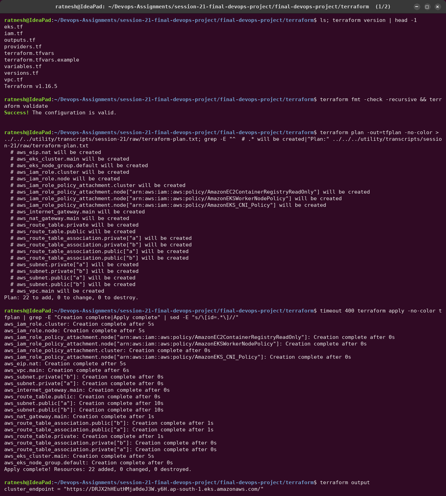
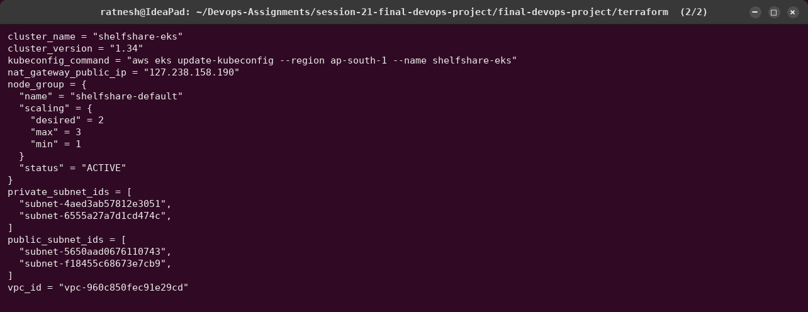
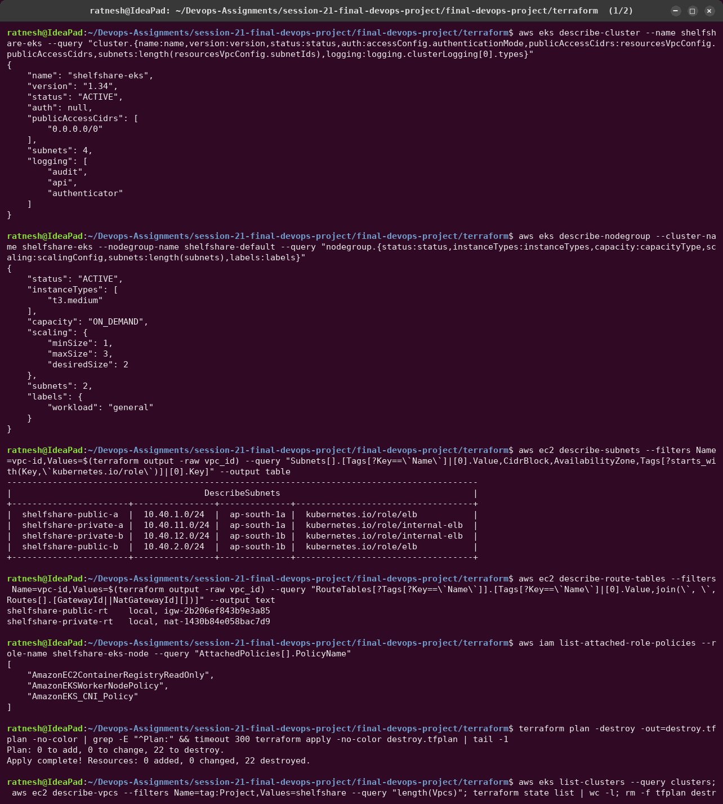
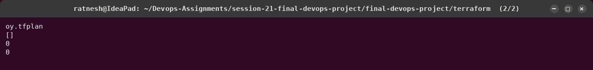

The full plan is in
[`raw/terraform-plan.txt`](../../utility/transcripts/session-21/raw/terraform-plan.txt). To
use real AWS: configure credentials and delete the `aws_endpoint` line from
`terraform.tfvars`. An EKS cluster with a NAT gateway costs money per hour, so destroy it when
done.

## 10. CI/CD pipeline

[`pipeline.yml`](.github/workflows/pipeline.yml) (GitHub runs the identical
[`/.github/workflows/session-21-pipeline.yml`](../../.github/workflows/session-21-pipeline.yml)
at the repository root):

```text
backend-test ─┐                      ┌─ sast ────────┐
frontend-build┴────────────────────► ├─ sca ─────────┼─► docker-build ─► image-scan ─┐
                                     └─ secret-scan ─┘                              │
                                security-gate (one policy over 8 reports) ◄─────────┘
                                     │
                                   push   both images, tag = full commit SHA
                                     │
                                   deploy DEPLOY_MODE=gitops → commit the tag to the GitOps repo
                                          DEPLOY_MODE=kind   → throw-away kind cluster, helm install, helm test
```

- **Tests:** pytest with coverage and JUnit reports; Vite build; both uploaded as artifacts.
- **Images:** built once and saved as tarballs. **Trivy scans the exact tarballs that are
  pushed**, not a rebuild.
- **Tags:** the full commit SHA, so every running Pod can be traced to a commit (the backend
  also reports it at `/health` as `build`).
- **Registry:** `ghcr.io/<owner>/shelfshare-{backend,frontend}` using `GITHUB_TOKEN`
  (`packages: write` only on the push job). In the lab the variable `REGISTRY=localhost:5001`.
- **Deploy:** on GitHub-hosted runners there is no route to my laptop's cluster, so the default
  `DEPLOY_MODE=kind` proves the chart deploys in a fresh cluster and passes `helm test`. With
  `DEPLOY_MODE=gitops` and the `GITOPS_REPO` secret, CI only commits the new tag and Argo CD
  does the rollout (that is how it ran here).
- Pull requests run everything up to the gate; push and deploy only run on `main`.

Run locally with act (all 10 jobs):

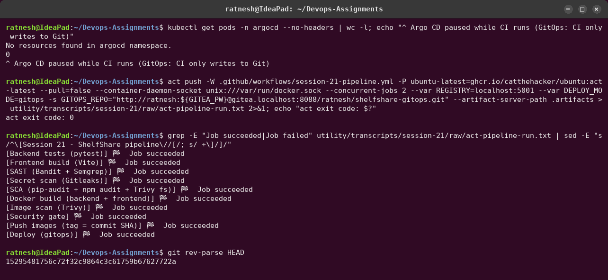


The full job log is in
[`raw/act-pipeline-run.txt`](../../utility/transcripts/session-21/raw/act-pipeline-run.txt).

## 11. DevSecOps implementation

| Stage | Tool | Scope | Blocks on |
|---|---|---|---|
| SAST | Bandit ([`bandit.yaml`](security/bandit.yaml)) | backend | any HIGH |
| SAST | Semgrep: `p/python`, `p/react` + [3 custom rules](security/semgrep-rules.yml) (hard-coded credentials, SQL string formatting, `dangerouslySetInnerHTML`) | both | any `ERROR` |
| SCA | pip-audit, npm audit (runtime deps), Trivy fs | lock files | any known-vulnerable Python package; HIGH/CRITICAL npm advisory or Trivy finding |
| Secrets | Gitleaks ([`.gitleaks.toml`](security/.gitleaks.toml)), output always redacted | full Git history | any secret |
| Images | Trivy ([`trivy.yaml`](security/trivy.yaml)) on both images | OS + language packages | any HIGH/CRITICAL, fixed or not |
| Gate | [`security-gate.sh`](security/security-gate.sh) reads all 8 JSON reports, prints one table, exits non-zero on any blocking finding; a missing report also fails | | |
| Runtime | non-root images, `readOnlyRootFilesystem`, all capabilities dropped, seccomp `RuntimeDefault`, no service-account token | Pods | Pod Security `restricted` |

Scanner binaries are installed by [`install-tools.sh`](security/install-tools.sh) at pinned
versions with **SHA-256 verification**: a supply-chain control for the pipeline itself.

**A real finding.** The first frontend image (`1.0.0`) had **42 fixable HIGH/CRITICAL CVEs** in
Alpine packages of the nginx base image. Fix: `apk upgrade` and remove `curl`, which nginx
does not need. Result: **0**.

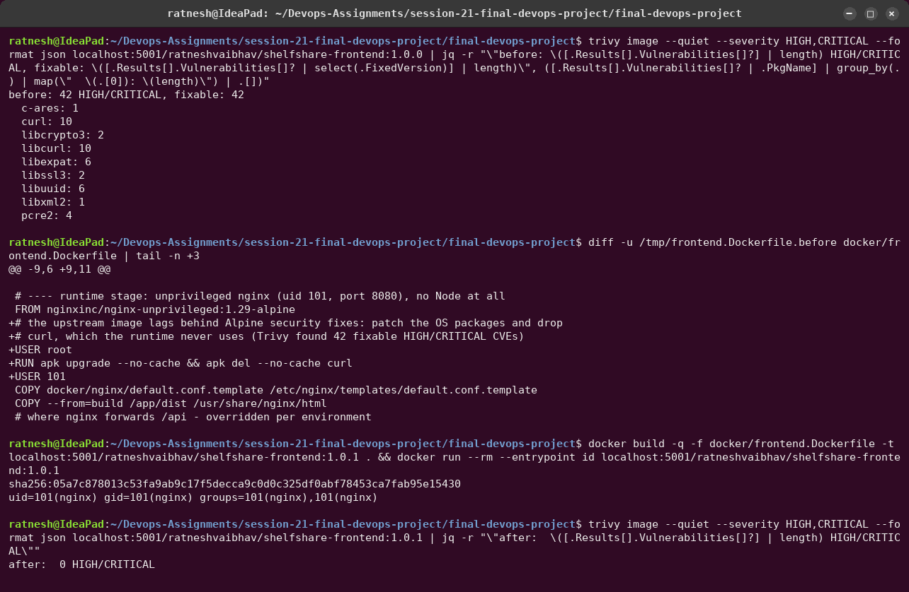
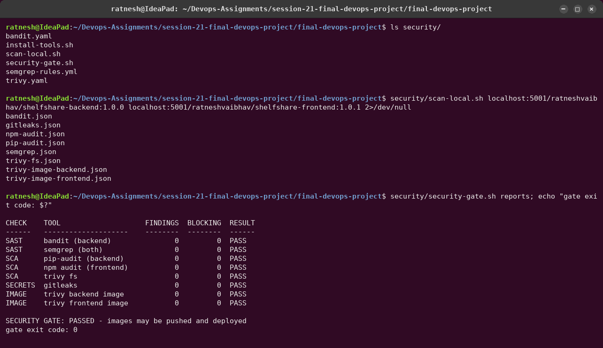

`scan-local.sh` scans only the files Git would commit, because the local Terraform state and
`kubernetes/db.env` contain real values and are git-ignored on purpose.

## 12. Monitoring

- The backend exposes `/metrics` (prometheus-fastapi-instrumentator plus two business counters).
  It is **not** exposed through the Ingress.
- The chart creates a **ServiceMonitor** (15 s), a **PrometheusRule** with
  `ShelfShareBackendDown`, `ShelfShareDatabaseDown`, `ShelfShareHighErrorRate` (> 5 % 5xx)
  and `ShelfShareHighLatency` (p95 > 500 ms), and a **Grafana dashboard** ConfigMap that the
  Grafana sidecar picks up (12 panels: availability, request rate by handler, status classes,
  p50/p95/p99, HPA replicas, CPU and memory per pod, firing alerts).
- The stack is kube-prometheus-stack, installed with
  [`kube-prometheus-stack-values.yaml`](monitoring/kube-prometheus-stack-values.yaml). It
  cross-namespace discovers ServiceMonitors and rules, and keeps the TSDB on a PVC.
- [`traffic.sh`](monitoring/traffic.sh) generates mixed traffic (200/201/204/404/409).
- **Logs:** the backend writes one JSON object per request (`method`, `path`, `status`,
  `duration_ms`; probes and `/metrics` are skipped), next to uvicorn's plain lines, so
  `kubectl logs -n shelfshare -l app.kubernetes.io/component=backend -c api --tail=-1 | grep '^{' | jq 'select(.status >= 400)'`
  filters them (screenshot in [section 7](#7-kubernetes-deployment)). The `--tail=-1` matters:
  with a label selector, `kubectl logs` keeps only 10 lines per pod.


The 4-worker load test overloaded the laptop's node; that incident, and the two monitoring
bugs it revealed (counters that reset, a TSDB on an emptyDir), are in
[troubleshooting I3–I5](troubleshooting/README.md#i3--the-load-test-overloaded-the-node).

## 13. GitOps

- **Git server:** Gitea inside the cluster (`gitea.localhost`) plays GitHub's role, so the
  whole loop runs on the laptop. Repo `ratnesh/shelfshare-gitops` holds
  `charts/shelfshare` and `environments/dev/values.yaml`. Its full history is in
  [`gitops/shelfshare-gitops.bundle`](gitops/shelfshare-gitops.bundle)
  (`git clone shelfshare-gitops.bundle`).
- **Argo CD Application** [`shelfshare-app.yaml`](gitops/argocd/shelfshare-app.yaml): chart path
  plus the environment values file, `automated: {prune: true, selfHeal: true}`,
  `CreateNamespace=true`, 30 s reconciliation.
- [`bootstrap.sh`](gitops/bootstrap.sh) creates the repo, pushes the chart and values, and
  registers the Application. That is the only manual `kubectl apply`.
  [`gitops/environments/dev/values.yaml`](gitops/environments/dev/values.yaml) is the seed it
  pushes (tag `1.0.1`); the live file, with the tag CI wrote, is in the bundle.
- The release was **handed over from Helm to Argo CD** without losing data: `helm uninstall`
  keeps the PVC and the Secret, and Argo CD adopted them.

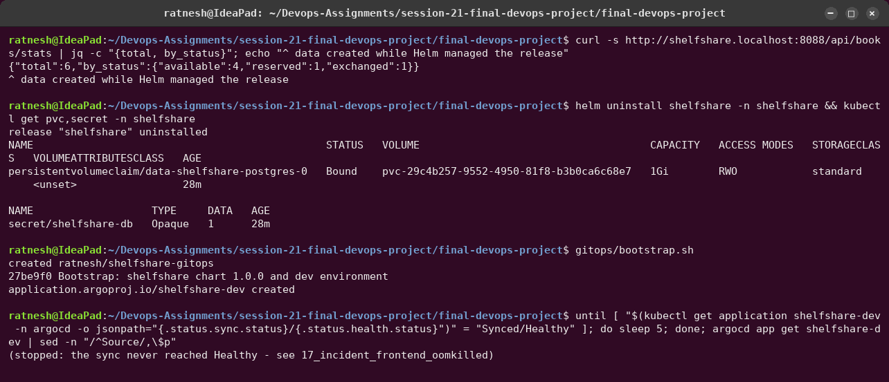

**CI → Git → Argo CD → cluster, verified end to end.** The pipeline committed tag
`15295481…` as `shelfshare-ci`. Argo CD synced commit `3c52022`, and every Pod runs the image
built from commit `15295481756c` of this repository:


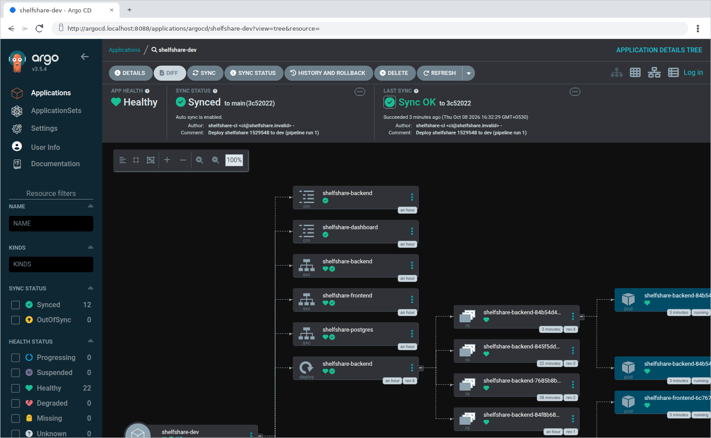
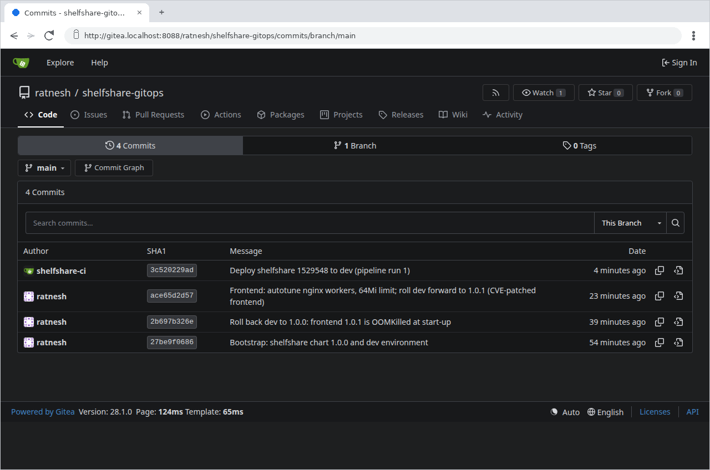

Final state after the troubleshooting challenge (11 commits, every change made through Git):

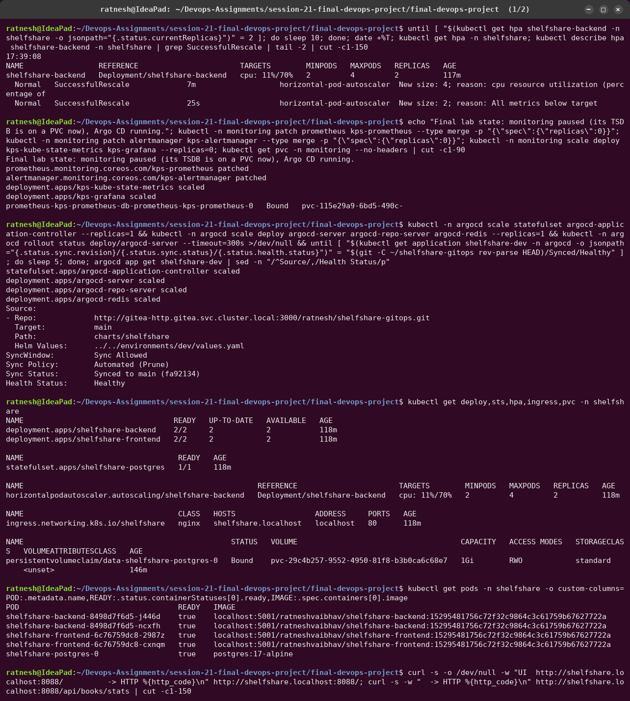
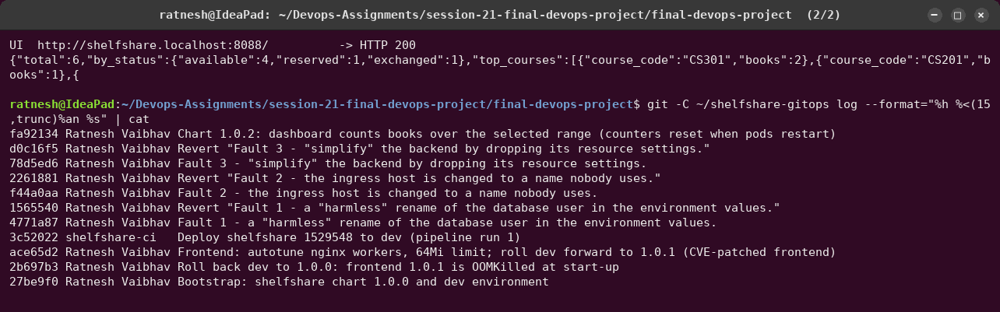
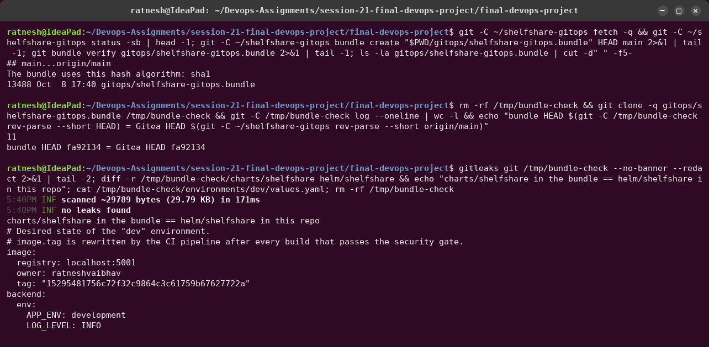


## 14. Troubleshooting

The full write-up, with every screenshot, is in
**[`troubleshooting/README.md`](troubleshooting/README.md)**.

| # | Issue | Root cause | Fix |
|---|---|---|---|
| F1 | backend `CrashLoopBackOff` after renaming the DB user | `POSTGRES_USER` only applies on an empty volume | `git revert` |
| F2 | all URLs 404 while Argo CD says Healthy | Ingress host typo; the catch-all server does not even log | `git revert` |
| F3 | HPA `<unknown>`, app Degraded | no CPU request → no utilisation | `git revert` |
| I1 | frontend `OOMKilled` after the CVE fix | node overcommitted, 12 nginx workers, 48Mi | Git rollback, chart fix, roll forward |
| I2 | Ingress sync rejected | admission webhook down after controller restarts | restart controller, re-sync |
| I3 | load test took the node down | HPA added pods to a node with no memory left | scale down, restart a 950 MB kube-apiserver |
| I4 | dashboard said 0 books | raw counters reset with pods | `increase()` over the range, chart 1.0.2 via GitOps |
| I5 | metrics history gone | TSDB on an emptyDir | PVC via `storageSpec`, verified across a restart |

## 15. Screenshots

All in [`utility/screenshots/session-21/`](../../utility/screenshots/session-21/), each
rendered from the transcript with the same name in
[`utility/transcripts/session-21/`](../../utility/transcripts/session-21/).

| # | Screenshot | Section |
|---|---|---|
| 01–02 | backend tests, frontend build | [5](#5-application-setup) |
| 03–06, web 01–02 | Compose up / API / down, build and push | [6](#6-docker-setup) |
| 07–09, web 03 | raw Kubernetes manifests | [7](#7-kubernetes-deployment) |
| 10–11 | Helm install, test, upgrade | [8](#8-helm-deployment) |
| 12–13 | Terraform plan / apply / verify / destroy | [9](#9-terraform-infrastructure-vpc--eks) |
| 14–15 | image CVEs fixed, local security gate | [11](#11-devsecops-implementation) |
| 16, 23, 35–36, web 04–05, 08 | GitOps handover, CD verification, final state, bundle | [13](#13-gitops) |
| 17–20 | incidents I1–I2 | [troubleshooting](troubleshooting/README.md) |
| 21–22 | pipeline run | [10](#10-cicd-pipeline) |
| 24–27 | injected faults F1–F3 | [troubleshooting](troubleshooting/README.md) |
| 28–29, web 07 | monitoring | [12](#12-monitoring) |
| 30–34, web 06 | incidents I3–I5 | [troubleshooting](troubleshooting/README.md) |

## 16. Lessons learned

1. **Healthy is not working.** F2 passed every probe and Argo CD check while every user got a
   404. Probes test pods from inside; something has to test the public URL.
2. **Mitigate first, investigate second.** For I1 a Git rollback restored service in a minute.
   The root cause took much longer, and the obvious suspect (the new image) was innocent once
   tested.
3. **Some config only works once.** Database init variables, like many first-boot settings,
   do nothing on an existing volume (F1). Changing them needs a migration.
4. **Requests are the HPA's denominator.** No request, no autoscaling (F3). A request far
   below real usage (50m vs ~150m) makes the HPA scale out on light traffic.
5. **An HPA adds pods, not capacity.** On one memory-starved node, scaling out made the
   outage worse (I3). Real clusters need node autoscaling and headroom.
6. **Monitoring that shares the failure domain goes blind when needed.** The dashboard has
   holes exactly during the incident, and the TSDB on an emptyDir was lost on every restart
   (I5).
7. **Never chart a raw counter.** Counters reset when the process restarts; `rate()` and
   `increase()` handle it (I4).
8. **GitOps makes every change reviewable and reversible.** 11 commits: bootstrap, rollback,
   roll-forward, CI promotion, 3 faults, 3 reverts and a dashboard fix. Each is visible in
   `argocd app history`, and the cluster never drifted from Git.
9. **Scan what you ship.** Trivy found 42 fixable CVEs in a base image that `docker build` had
   happily produced. The pipeline scans the exact tarballs it pushes.
10. **Be honest in the record.** When a mitigation silently failed (the first kube-apiserver
    restart) the transcript says so, followed by the retry that worked.
