# Troubleshooting challenge

The final challenge asks for issues to be introduced on purpose, then identified, investigated,
root-caused, fixed and verified. I did that with **three injected faults**. Running the project
on a laptop also produced **five real incidents** that nobody planned. Those are written up
here the same way, because they taught more than the injected ones.

Every fault and every fix went through **Git**: the cluster is managed by Argo CD from the
GitOps repository in Gitea, so a fault is a bad commit and a fix is a `git revert` (or a new
commit). No `kubectl edit` was used on the application.

| # | What | Kind | Symptom | Root cause | Fix |
|---|---|---|---|---|---|
| F1 | [Database user renamed](#f1--database-user-renamed-in-the-values) | injected | new backend pod in `CrashLoopBackOff` | `POSTGRES_USER` only applies to an empty volume, so the role never existed | `git revert` |
| F2 | [Ingress host typo](#f2--ingress-host-changed) | injected | every URL returns 404; Argo CD shows **Healthy** | Ingress rule now matches `shelfshare.local` only | `git revert` |
| F3 | [Resources removed](#f3--backend-resources-removed) | injected | HPA `cpu: <unknown>`, app `Degraded` | HPA utilisation is a % of the CPU *request*, and there was none | `git revert` |
| I1 | [Frontend OOMKilled after a CVE fix](#i1--frontend-oomkilled-during-the-gitops-handover) | real | frontend `CrashLoopBackOff`, `OOMKilled` | node memory overcommitted, 12 nginx workers per pod, no headroom in 48Mi | rollback via Git, then a chart fix rolled forward |
| I2 | [Ingress admission webhook down](#i2--ingress-admission-webhook-unavailable) | real | Argo CD sync of the Ingress failed | ingress-nginx controller restarted under memory pressure | restart the controller, re-sync |
| I3 | [Load test took the node down](#i3--the-load-test-overloaded-the-node) | real | probes timing out, pods restarting, metrics API gone | 4 replicas + monitoring + a 950 MB kube-apiserver in a 3.2 GiB VM | scale back to 2, restart kube-apiserver |
| I4 | [Dashboard showed 0 books](#i4--the-dashboard-showed-0-books-after-the-incident) | real | Grafana "Books listed" = 0 after hundreds of listings | counters reset when pods restart; the stat summed raw counters | `increase()` over the range, chart 1.0.2 via GitOps |
| I5 | [Metrics history lost](#i5--prometheus-lost-its-history) | real | queries for the load test returned nothing | Prometheus TSDB was an `emptyDir` | `storageSpec` PVC, verified across a pod restart |

## How a fault is injected

[`inject.sh`](inject.sh) deep-merges one fault file into `environments/dev/values.yaml` of the
GitOps working copy, commits it with the fault's first comment line as the message and pushes,
exactly like a bad pull request being merged:

```bash
troubleshooting/inject.sh troubleshooting/01-wrong-db-user.values.yaml
```

| Fault file | Change |
|---|---|
| [`01-wrong-db-user.values.yaml`](01-wrong-db-user.values.yaml) | `database.user: shelfshare_app` |
| [`02-ingress-host-typo.values.yaml`](02-ingress-host-typo.values.yaml) | `ingress.host: shelfshare.local` |
| [`03-hpa-without-requests.values.yaml`](03-hpa-without-requests.values.yaml) | `backend.resources: null` |

The investigation method was the same every time: **symptom → what does Argo CD say → pods,
events, logs → the object that is wrong → which commit changed it → fix in Git → verify the
symptom is gone.**

---

## F1 — Database user renamed in the values

**Injected:** someone "tidies up" the database user name: `database.user: shelfshare_app`.


**Identify.** Argo CD applied the commit and went `Progressing`. One new backend pod crash-loops.
Users noticed nothing: the rolling update (`maxUnavailable: 0` for 2 replicas) keeps the two
old pods serving, so every request still returned 200. That is the point of rolling updates
and readiness probes, but it also means the fault is easy to miss.

![investigation: the pod's events show startup probe failures and back-off, the previous container logs show psycopg OperationalError password authentication failed for user, the configmap and the postgres pod both say shelfshare_app, postgres logs say role shelfshare_app does not exist, pg_roles only has shelfshare; root cause stated; git revert pushed as 1565540; Argo CD Synced and Healthy at 16:38:55; pods all Running with DB_USER back to shelfshare; the API answers; postgres log shows Skipping initialization](../../../utility/screenshots/session-21/25_fault1_investigate_fix_1.png)
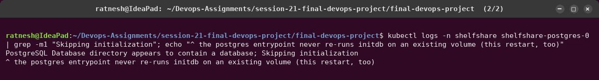

**Investigate.**
- `kubectl describe pod` showed back-off restarts; `kubectl logs --previous` showed
  `FATAL: password authentication failed for user "shelfshare_app"`.
- The ConfigMap (`DB_USER`) and the Postgres StatefulSet (`POSTGRES_USER`) both had the new name,
  so the chart rendered what the values asked for.
- The Postgres log said `role "shelfshare_app" does not exist`; `pg_roles` lists only
  `shelfshare`.

**Root cause.** The official Postgres image applies `POSTGRES_USER`/`POSTGRES_PASSWORD` only
when `initdb` runs on an **empty** data directory. The PVC already holds the database
(`Skipping initialization`), so changing the env var renamed nothing. The backend logged in as a
user that does not exist.

**Fix and verify.** `git revert` of the fault commit. Argo CD synced in about 30 s, the crashing
ReplicaSet was dropped, `DB_USER=shelfshare`, the API answered. A real rename has to be a
migration (`ALTER ROLE ... RENAME TO ...` plus a password reset), not a values change.

## F2 — Ingress host changed

**Injected:** `ingress.host: shelfshare.local`.


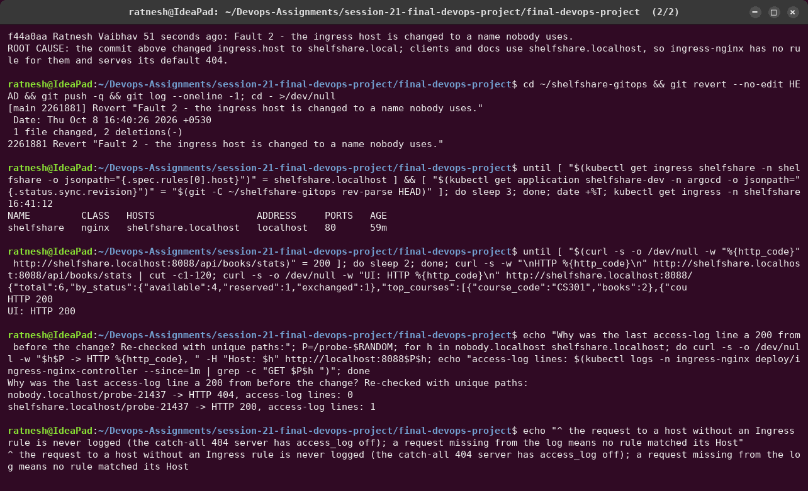

**Identify.** This is the dangerous kind: **Argo CD says Synced/Healthy, every probe passes**,
and yet every user gets `404 Not Found`. Health checks look at the pods from inside the
cluster; nothing checks the public URL.

**Investigate.** I went outside-in, following the request path:
1. `curl` → 404 page from nginx, so the request reaches ingress-nginx.
2. Pods ready, EndpointSlices have addresses → Services and Pods are fine.
3. `kubectl get ingress` → `HOSTS shelfshare.local`.
4. `curl -H "Host: shelfshare.local"` → the app answers. The routing rule is wrong, not the app.
5. `git log -1` on the GitOps repo → the commit that changed it.

The ingress-nginx access log was a misleading clue. Its last `/api/books/stats` line was a
**200 from before the change**, because the 404s were not logged at all. Re-checked with unique
paths: a request for a host without an Ingress rule falls to the catch-all server, which has
`access_log off` in `nginx.conf`. **A request missing from the access log means no rule matched
its Host.**

**Fix and verify.** `git revert`; the Ingress was back to `shelfshare.localhost` and the API and
UI returned 200. Prevention: a smoke test against the public URL after every sync, for example a
post-sync hook or the pipeline's `helm test` hitting the Ingress instead of the Service.

## F3 — Backend resources removed

**Injected:** "simplify" the values: `backend.resources: null`.


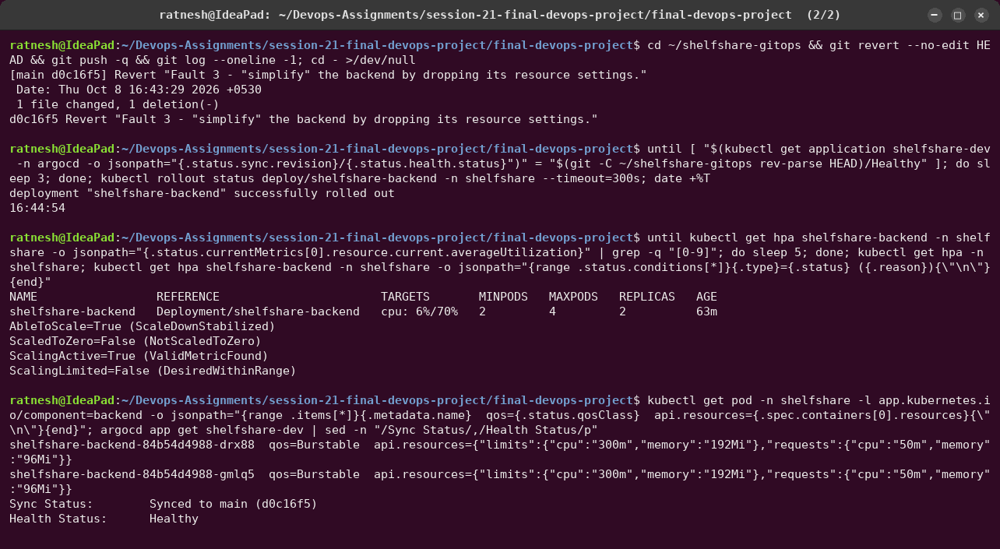

**Identify.** The app kept working, but the HPA showed `cpu: <unknown>/70%`, and Argo CD marked
the application **Degraded** because of the HPA. Argo CD's health check reads the HPA's
`ScalingActive` condition.

**Investigate.** `kubectl describe hpa` → `ScalingActive False FailedGetResourceMetric: missing
request for cpu in container api`. The pods' `resources` are `{}`.

**Root cause.** `targetCPU: 70` means 70 % **of the CPU request**. Without a request there is
no denominator, so the HPA can never scale. Removing the block also removed the memory limit,
so one leaking pod could take the whole node.

**Fix and verify.** `git revert`; the HPA reports `cpu: 6%/70%`, `ScalingActive True
(ValidMetricFound)`, Argo CD Healthy. Prevention: a `LimitRange` with default requests in the
namespace, or a policy (Kyverno/Gatekeeper) that rejects Pods without requests.

---

## I1 — Frontend OOMKilled during the GitOps handover

**What happened.** While I moved the release from Helm to Argo CD
([`16_gitops_handover`](../../../utility/screenshots/session-21/16_gitops_handover.png)), the
new CVE-patched frontend image `1.0.1` went into `CrashLoopBackOff`: `OOMKilled`, exit 137, at
a 48Mi limit, and the sync never became Healthy.


**First mitigate, then investigate.** I rolled back **through Git** (`tag: "1.0.0"`, commit
`2b697b3`) to restore service, and only then looked for the cause. The data in the PVC
survived the handover and the rollback.


**Root cause, tested hypothesis by hypothesis.**
- *"The new image needs more memory"* (it upgraded `apk-tools`, and the entrypoint calls
  `apk manifest`): **disproved.** Both images run fine under a 48m limit in plain Docker, with
  2–3 MiB used.
- What both images had in common: **12 nginx worker processes**, because nginx sized itself
  to the node's 12 CPUs, not to the pod's 100m CPU limit.
- The namespace events had **19 probe timeouts**. The whole node was overcommitted: Argo CD,
  Gitea, the full monitoring stack and two copies of the app inside a 3.2 GiB VM. Under memory
  pressure, page cache is reclaimed and every process's working set (12 workers) presses on a
  limit with no headroom.

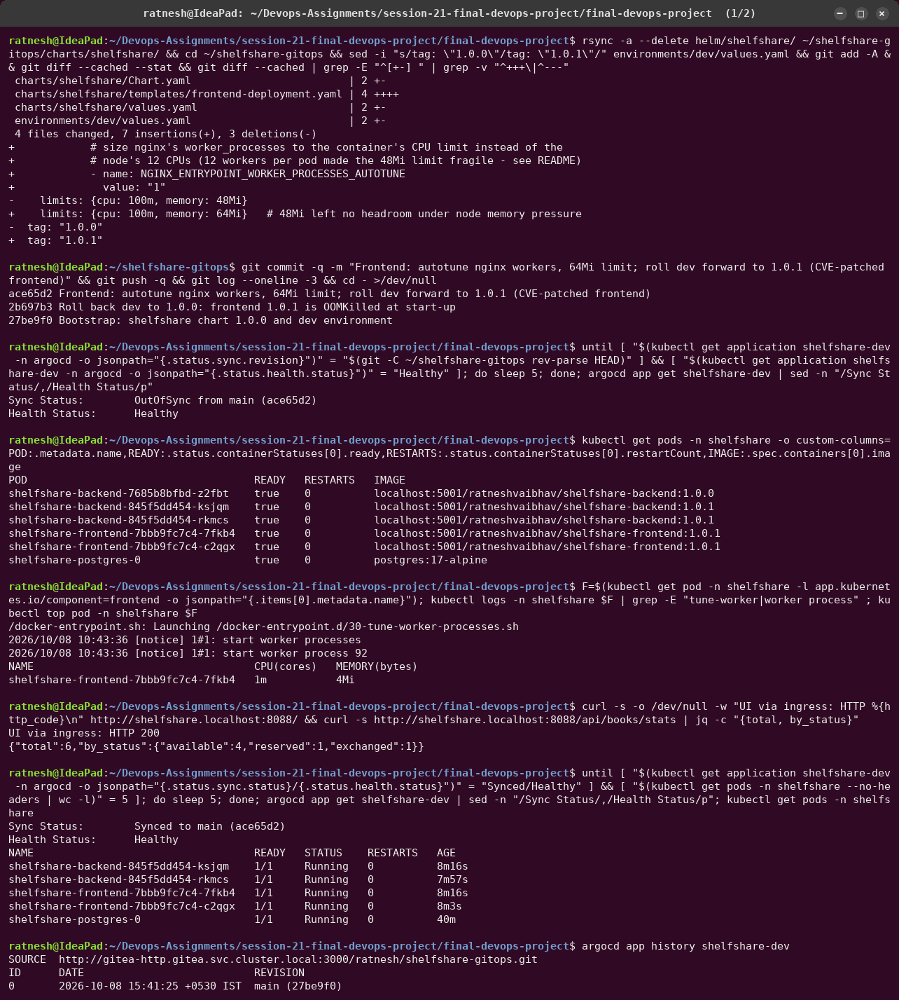
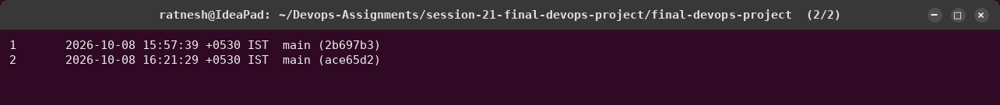

**Fix and verify.** I paused the monitoring stack to give the node headroom, then fixed the
chart: `NGINX_ENTRYPOINT_WORKER_PROCESSES_AUTOTUNE=1` (workers follow the CPU limit) and a 64Mi
limit. Then I **rolled forward** to 1.0.1 (`ace65d2`): one worker, 4 MiB, no restarts.

## I2 — Ingress admission webhook unavailable

During the overload above, the ingress-nginx controller had failed its liveness probe and was
restarted repeatedly. Argo CD's sync of the Ingress then failed, because the API server calls
the controller's **validating admission webhook** for every Ingress change, and nothing was
listening.

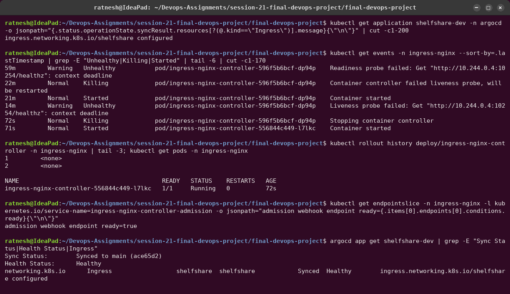

Fix: `kubectl rollout restart` of the controller, wait for the admission endpoint to be ready,
then trigger a sync (`operation.sync` on the Application). Lesson: a component that serves an
admission webhook is in the critical path of **every** deploy that touches its objects.

## I3 — The load test overloaded the node

**What happened.** For the monitoring demo I ran [`traffic.sh`](../monitoring/traffic.sh)
with 4 workers. The HPA scaled the backend **2 → 4 in 40 s** (CPU 417 % of the request), which
is what it should do. Then the node fell over: probes timed out, backend and frontend pods
restarted, metrics-server lost its endpoints, and the HPA went back to `<unknown>`.

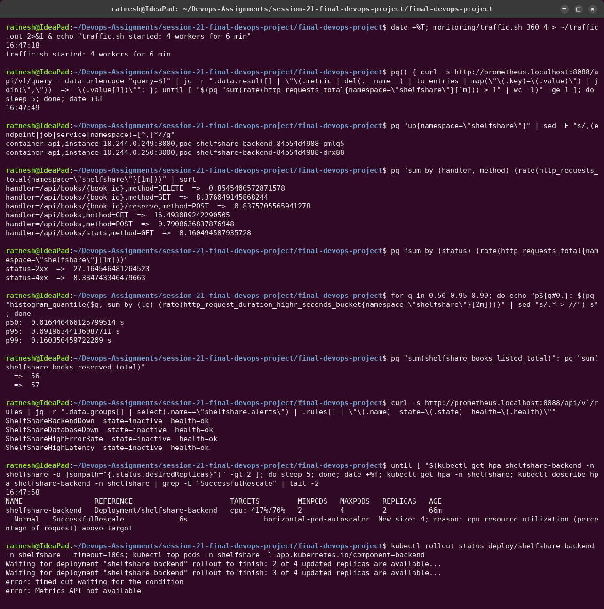


**Investigate.** `docker stats` and `/proc/pressure/memory` inside the node: 2.7/3.2 GiB used,
~200 MB available, swap almost full, **PSI "full" 12 %** (all tasks stalled on memory 12 % of
the time). `top` showed 55 % of the CPU time in I/O wait and almost none idle: the node was
thrashing (paging), not computing. CPU itself was not the problem; the VM has 12 vCPUs. The biggest process was **kube-apiserver at ~950 MB**.

**Root cause.** Memory overcommit, not CPU. The HPA added two pods to a node that had no memory
left, on top of the monitoring stack and an apiserver whose caches had grown during the day.
**An HPA adds pods, not capacity.** On one node, scaling out under memory pressure makes things
worse. On EKS, the Cluster Autoscaler or Karpenter would add a node for the pending pods.


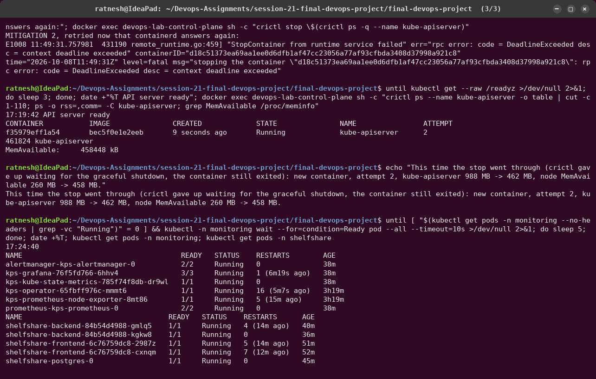

**Mitigation, as it really happened.**
1. Scale the backend to 2 by hand. The HPA had no metrics, so it did not fight back. All pods
   were ready again at 17:12.
2. Restart kube-apiserver (a static pod: stop its container and the kubelet starts a new one).
   The **first attempt did nothing**: containerd was too slow to even list containers. I
   recorded that and a correction instead of pretending. The retry worked: **988 MB → 462 MB**,
   node available memory 260 → 458 MB.

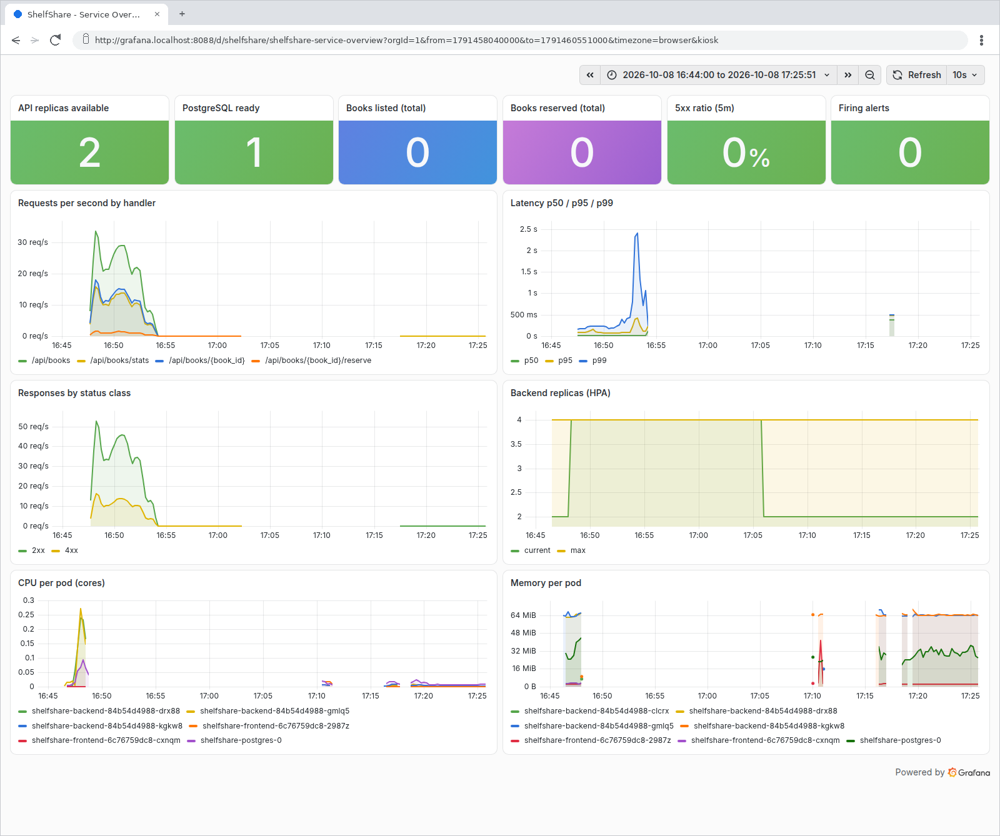

The dashboard shows it all: p99 latency climbing to 2.4 s before the collapse, replicas 2 → 4 →
2, and **holes in the CPU and memory panels**. Monitoring runs on the same node, so it went
blind exactly when it was needed. In production, monitoring runs on separate nodes, or
off-cluster.

Permanent fixes: give the Docker VM more memory (the laptop's 13.8 GB is shared with the
desktop), base the CPU request on measured usage (the API used ~150m under load against a 50m
request), and cap `maxReplicas` to what the node can hold.

## I4 — The dashboard showed 0 books after the incident

After hundreds of listings, Grafana's "Books listed (total)" said **0**.

![at 17:25:51 sum of the counters is 0 while sum of increase is 410; traffic.sh created 407 listings; root cause; the dashboard JSON changed to round(sum(increase(...[$__range]))) with new titles; chart 1.0.2 lints and renders](../../../utility/screenshots/session-21/31_dashboard_counter_fix.png)

**Root cause.** A Prometheus counter lives in the process. Every backend pod had restarted
during I3, so the sum of the *current* counters was 0. `increase()` follows each series across
resets: 410 (Prometheus extrapolates), against 407 listings that `traffic.sh` really created.

**Fix through GitOps.** The panel became `round(sum(increase(...[$__range])))`, chart 1.0.2,
committed to Gitea (`fa92134`), synced by Argo CD. I verified it in Grafana: 96 listings
reported for a 90 s run that created exactly 96.

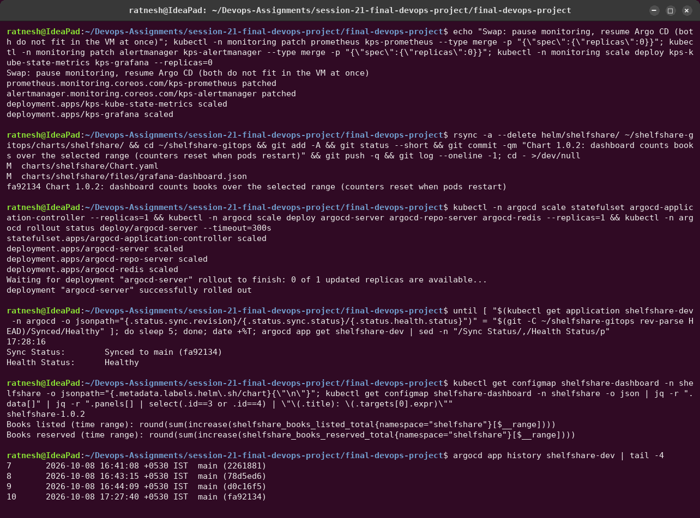

Side effect worth knowing: the chart bump also **restarted the backend pods**. The
`checksum/config` annotation hashes the whole rendered ConfigMap, including the
`helm.sh/chart` label, so a version bump changes it. Hashing only `.data` would avoid that.

## I5 — Prometheus lost its history

When I tried to query the load test again later, Prometheus returned nothing.

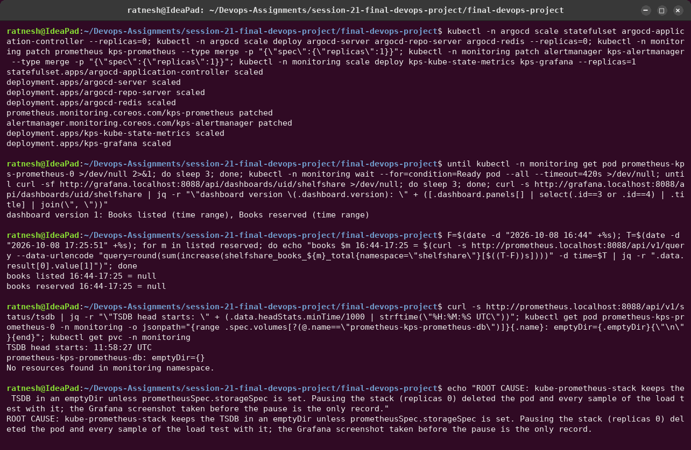

**Root cause.** kube-prometheus-stack keeps the TSDB in an **emptyDir** unless
`prometheusSpec.storageSpec` is set. Every time the stack was paused to save memory, the pod
was deleted and its data with it. The Grafana screenshot above is the only remaining record of
the load test.


**Fix and verify.** I added a 2Gi `volumeClaimTemplate` (and `retentionSize`) to
[`kube-prometheus-stack-values.yaml`](../monitoring/kube-prometheus-stack-values.yaml) and ran
`helm upgrade`. Then I deleted the Prometheus pod on purpose: the samples written before the
restart were still queryable after it.

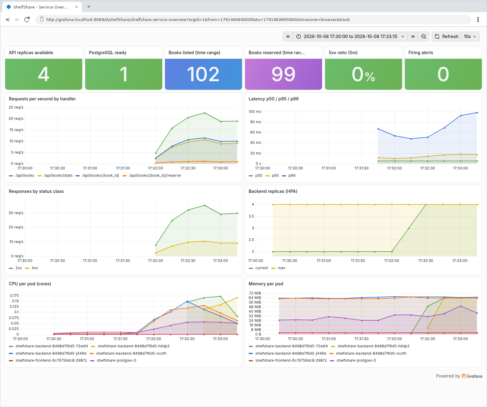

---

## What I would put in place so these do not reach users again

| Gap | Guard |
|---|---|
| F1: config that only works on first start | treat DB users as migrations; a CI check that fails when `database.user` changes for an existing environment |
| F2: healthy pods, broken URL | post-sync smoke test against the public hostname; alert on the ingress 404 rate |
| F3: Pods without requests | `LimitRange` defaults + a policy that rejects Pods without requests |
| I1, I3: overcommit | requests from measured usage, `maxReplicas` sized to the nodes, node autoscaling, monitoring on its own nodes |
| I4: counters | use `rate()`/`increase()` on counters everywhere, never the raw value |
| I5: monitoring data | persistent storage for Prometheus (and remote-write for anything that matters) |
